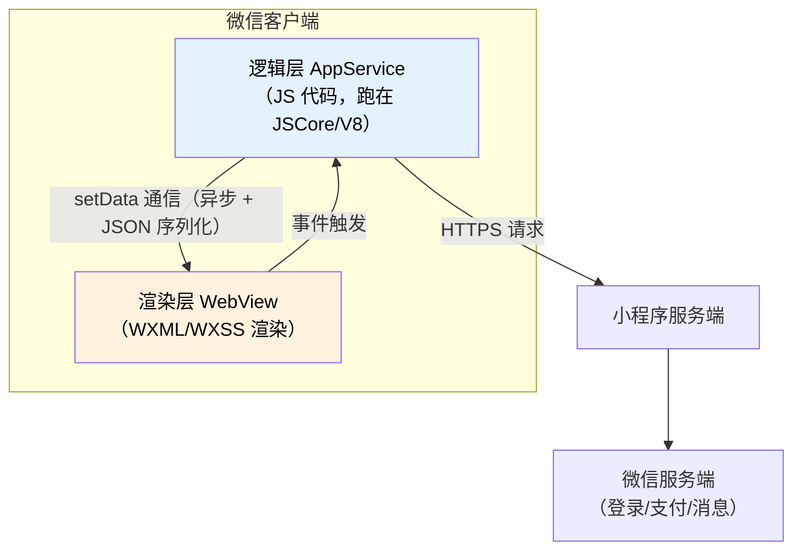
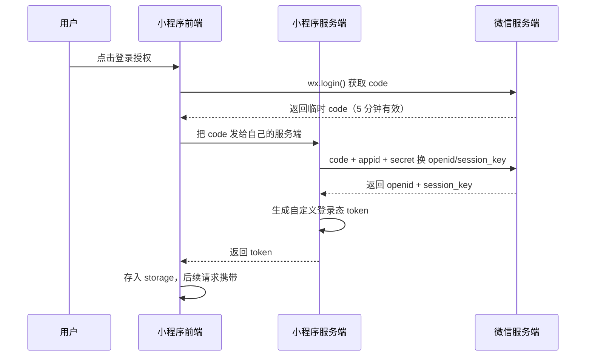
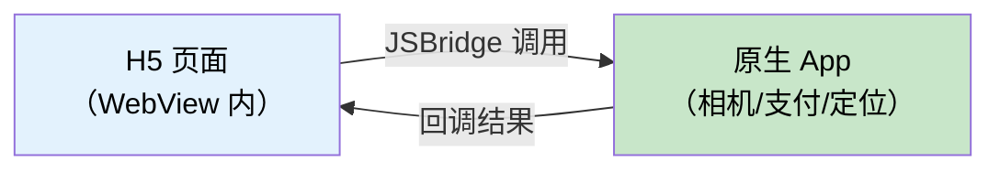

# 小程序与 H5 测试教程（软件测试人员专用）

> 本教程面向软件测试工程师，系统讲解微信小程序与 H5 页面的测试方法。覆盖微信开发者工具使用、小程序架构与生命周期、登录与支付等微信生态链路、小程序专项性能测试、H5/WebView 与原生交互测试，以及小程序自动化落地。

<div class="tutorial-meta">
    <span class="difficulty-badge difficulty-intermediate">📙 进阶难度</span>
    <span class="meta-item">⏱ 约 3 天</span>
    <span class="meta-item">📋 前置：Web 测试基础、抓包工具、测试用例设计</span>
    <span class="meta-item">🎯 目标：能独立完成小程序与 H5 的全流程测试</span>
</div>

| 项目 | 要求 | 获取方式 |
|------|------|----------|
| 测试基础 | 掌握用例设计、缺陷提交 | [软件测试理论基础](../基础理论/软件测试理论基础教程.md) |
| 抓包工具 | 会用 Charles 或 Fiddler | [Charles 抓包教程](../工具操作/Charles抓包教程-软件测试版.md) |
| 前端基础 | 了解 HTML/CSS/JS，会用浏览器控制台 | [前端基础教程](../基础理论/前端基础教程-软件测试版.md) |
| 移动端测试 | 了解弱网、兼容性测试方法 | [移动端专项测试](../专项测试/移动端专项测试教程-软件测试版.md) |

---

## 新手导读

小程序不是"小一点的 App"，也不是"手机上的网页"。它是一个**跑在微信宿主环境里、受平台规则强约束的应用**。

这个定位带来三个测试上独有的难点：

| 难点 | 具体表现 |
|------|----------|
| **平台约束多** | 包体积上限、请求域名白名单必须 HTTPS、并发请求数受限、本地存储上限，这些约束本身就是测试点 |
| **运行环境特殊** | 逻辑层和渲染层分离，普通浏览器调试手段失效，必须用微信开发者工具 |
| **生态链路长** | 登录、支付、分享要走微信的授权链路，涉及前端、小程序服务端、微信服务端三方交互 |

!!! abstract "第一遍重点掌握三件事"
    1. **会用微信开发者工具**（这是小程序测试的入场券，不会它就无法定位任何问题）
    2. **理解小程序生命周期**（很多缺陷都是生命周期理解错误导致的）
    3. **搞清微信登录链路**（`wx.login` → code → 换 openid，这条链路是最容易出问题的地方）

    这三件事掌握后，小程序测试的其余部分都能从"移动端测试 + Web 测试"迁移过来。

### 版本与维护说明

| 项目 | 说明 |
|------|------|
| 适用范围 | 微信小程序、支付宝/抖音小程序（原理相通）、H5 页面、WebView 混合页面 |
| 使用建议 | 开发者工具的界面和 API 会随版本更新，具体菜单位置请以你安装的版本为准 |
| 更新提醒 | 小程序的 API 限制（如请求并发数、包体积上限）微信官方会调整，测试前查阅最新官方文档 |

---

## 一、小程序测试与常规测试的差异

### 1.1 小程序 vs App vs H5

| 维度 | 原生 App | H5 页面 | 小程序 |
|------|----------|---------|--------|
| 运行环境 | 操作系统 | 浏览器 | 微信/平台宿主 |
| 安装 | 需下载安装 | 无需安装 | 无需安装（扫码即用） |
| 性能 | 最好 | 最差 | 介于两者之间 |
| 系统权限 | 完整 | 受限 | 需通过微信授权 |
| 调试方式 | 专用工具 | 浏览器 DevTools | 微信开发者工具 |
| 更新机制 | 应用商店审核 | 服务端直接更新 | 审核 + 灰度发布 |
| 包体积限制 | 无 | 无 | **有上限**（主包约 2MB） |
| 网络请求 | 无限制 | 无限制 | **域名必须备案且 HTTPS，并发数受限** |

### 1.2 小程序独有的测试维度

```text
常规测试维度                小程序额外维度
├── 功能测试               ├── 平台约束测试（包体积、域名白名单、API 限制）
├── 兼容性测试             ├── 微信生态链路（登录、支付、分享、订阅消息）
├── 性能测试               ├── 生命周期测试（页面栈、前后台切换）
├── 弱网测试               ├── 授权与权限测试（getUserProfile 等）
├── 安全测试               ├── 体验版/正式版差异
└── 界面测试               └── 板块与分包加载
```

### 1.3 小程序的技术架构（测试需要知道的）



!!! tip "为什么架构对测试重要"
    **逻辑层和渲染层是分离的、跨线程通信的。** 这解释了几类典型缺陷：

    - **`setData` 频繁调用导致卡顿**：因为它要走跨线程通信
    - **数据量大时渲染延迟**：JSON 序列化开销，一次传几十 KB 会明显卡顿
    - **页面销毁后 setData 报错**：异步回调回来时页面已经不在了

    不理解架构，你只能报"页面卡"，理解了就能写出"列表页 setData 单次传入 200 条数据，导致渲染耗时 1.2s"这种可定位的缺陷。

---

## 二、微信开发者工具

### 2.1 获取与基础配置

| 项目 | 说明 |
|------|------|
| 下载 | 微信官方文档站搜索"微信开发者工具"，选稳定版 |
| 登录 | 需用微信扫码登录；**测试使用的微信号要有该小程序的开发或体验权限** |
| 项目类型 | 选择"小程序"；如有 AppID 就填真实 AppID，无则用测试号 |
| 权限来源 | 向开发要"开发者权限"或"体验成员"邀请 |

!!! warning "测试人员拿到工具后的第一个问题：没有权限"
    小程序项目不是拿到代码就能跑的。你需要：

    | 方式 | 能做什么 | 怎么获得 |
    |------|----------|----------|
    | 开发者权限 | 完整功能，可上传代码 | 向管理员申请，需要微信号 |
    | 体验成员 | 可打开体验版，不能改代码 | 向管理员申请 |
    | 测试号 | 只能跑 Demo，连不上真实后端 | 自己注册，无需审核 |

    **入职后第一件事就是申请开发者权限**，否则你无法调试真机、无法抓包验证。

### 2.2 核心面板：测试最常用的五个

| 面板 | 位置 | 测试用途 |
|------|------|----------|
| **Console** | 底部「调试器」→ Console | 看日志、报错堆栈、`console.log` 输出 |
| **Network** | 调试器 → Network | 看所有请求：URL、参数、响应、耗时、状态码 |
| **Storage** | 调试器 → Storage | 查看本地缓存（`wx.setStorageSync` 写入的数据） |
| **AppData** | 调试器 → AppData | **实时查看页面 data 的值**，验证数据绑定 |
| **Wxml** | 调试器 → Wxml | 查看渲染后的真实 DOM 结构和样式（类似浏览器 Elements） |

!!! tip "AppData 面板是定位前端问题的利器"
    ```
    场景：页面上"实付金额"显示错误

    排查步骤：
    1. 打开 AppData 面板，找到页面 data 里的 payAmount 字段
    2. 看它的值是否正确
       - 值正确但页面显示错 → 是 WXML 绑定表达式的问题（前端渲染）
       - 值本身就错 → 是数据处理逻辑的问题（可能是接口返回或计算逻辑）
    ```

    这一步就把缺陷**从"金额显示错了"精确定位到"前端渲染问题"或"数据处理问题"**，开发无法打回。

### 2.3 真机调试

模拟器和真机行为经常不一致，**兼容性缺陷必须在真机验证**。

| 方式 | 说明 | 适用 |
|------|------|------|
| 模拟器 | 工具内置，快速验证功能 | 日常功能测试 |
| 真机调试 | 扫码在手机上打开，可看日志 | 定位真机独有问题 |
| 真机预览 | 扫码打开体验版，无调试面板 | 体验验证、给产品演示 |
| 远程调试 | 真机运行时在电脑上看调试信息 | 复杂真机问题定位 |

**真机调试步骤：**

```text
1. 工具顶部点「真机调试」→ 生成二维码
2. 用目标手机微信扫码
3. 手机会打开小程序，同时电脑上出现调试面板
4. 在手机上操作，在电脑上看 Console / Network
```

!!! warning "模拟器能过不等于真机能过"
    常见的真机独有问题：

    | 问题 | 原因 |
    |------|------|
    | 布局错乱 | 模拟器分辨率与真机不同、刘海屏安全区域 |
    | 接口请求失败 | 真机走的是真实网络，可能有代理或证书问题 |
    | 支付失败 | 支付只能在真机验证，模拟器无法完成 |
    | 字体显示异常 | 系统字体差异 |
    | 权限弹窗不出现 | 真机才有的系统授权流程 |

### 2.4 版本管理与发布流程

```text
开发版（开发自己上传，仅开发可见）
   ↓ 上传代码
体验版（体验成员可扫码使用，无审核）
   ↓ 提交审核（1-7 天）
审核通过
   ↓ 发布 / 分阶段发布
正式版（线上版本）
```

| 版本 | 测试用途 | 注意 |
|------|----------|------|
| 开发版 | 联调、提测 | 可能每小时都在变 |
| **体验版** | **测试主战场** | 需有体验权限；和正式版代码一致但环境可能不同 |
| 正式版 | 上线后验证、灰度验证 | 修改必须走审核 |

!!! abstract "发布相关的高频缺陷"
    - **体验版正常、正式版异常**：通常是环境配置或域名白名单问题
    - **分阶段发布比例设置错误**：导致部分用户看不到新功能
    - **上传时忘记修改版本号和备注**：无法追溯哪个版本提测
    - **审核被拒**：常见原因是功能不完整、涉及未备案内容

---

## 三、小程序生命周期

生命周期是小程序测试的核心考点，**大量缺陷源于生命周期理解错误**。

### 3.1 三层生命周期

```text
应用级（App）
   onLaunch  → 小程序初始化
   onShow    → 前台切换（从后台切回）
   onHide    → 切到后台
   onError   → 错误
   onPageNotFound

页面级（Page）
   onLoad    → 页面加载（只执行一次）
   onShow    → 页面显示（每次显示都执行）
   onReady   → 首次渲染完成
   onHide    → 页面隐藏
   onUnload  → 页面卸载（页面栈出栈时）

组件级（Component）
   created → attached → ready → detached
```

### 3.2 生命周期的关键测试点

| 场景 | 测试关注点 | 典型缺陷 |
|------|-----------|----------|
| 首次打开 | `onLoad` 里的接口请求是否成功 | 首屏数据缺失 |
| 从后台切回 | `onShow` 是否重新拉取最新数据 | 数据陈旧，用户看到过期信息 |
| 页面跳转返回 | 返回后页面数据是否刷新 | 下单后返回购物车，数量没更新 |
| 页面卸载 | 定时器、监听是否清除 | 内存泄漏、setData 报错 |
| 快速反复跳转 | 页面栈是否溢出 | 超过 10 层后 `navigateTo` 失败 |
| 小程序退出重进 | 本地缓存是否残留脏数据 | 上次登录态未清除 |

!!! warning "onLoad 和 onShow 的误用是最常见的缺陷来源"
    ```
    场景：用户在 A 页面下单成功，返回购物车页面

    ❌ 如果购物车数据只在 onLoad 里请求
       → 返回时 onLoad 不执行 → 购物车数量还是旧的 → 缺陷

    ✅ 应该放在 onShow 里，或返回时手动刷新
    ```

    **测试方法**：凡是"在页面 A 操作后回到页面 B"的场景，都要检查 B 的数据是否更新。**这是一条通用测试思路，能覆盖大量缺陷。**

### 3.3 页面栈测试

小程序页面栈最多 **10 层**，超过后只能使用 `redirectTo`。

```text
测试点：
1. 连续 navigateTo 超过 10 层会发生什么？（应失败或需业务层处理）
2. 深层次页面能否正常返回？
3. 从深层页面直接回到首页，中间页面是否被正确销毁？
4. 页面栈满时，业务兜底逻辑是否正确？
```

### 3.4 前后台切换测试清单

```text
- 切到后台再回来，页面数据是否刷新？
- 切到后台时正在进行的请求，回来后如何处理？
- 切到后台超过一定时间后回来（微信可能回收内存），页面是否正常？
- 视频/音频播放中切后台，是否正确暂停？
- 正在倒计时/计时任务，切后台后计时是否准确？
- 微信收到来电/视频通话打断小程序，恢复后是否正常？
```

---

## 四、微信生态链路测试

这部分是**小程序测试最有价值、最不可替代**的内容——H5 和 App 都没有。

### 4.1 登录链路（最重要）



**测试点：**

| 环节 | 测试点 |
|------|--------|
| `wx.login` | 能否正常获取 code；网络异常时的兜底 |
| code 交换 | **code 只能用一次**，重复使用应失败 |
| code 时效 | code 5 分钟过期，过期后应有正确提示 |
| token 存储 | 存储是否安全、是否被清理 |
| token 过期 | 过期后是否自动重新登录，是否影响用户体验 |
| 多设备登录 | 同一账号在多个设备登录的处理 |
| 授权拒绝 | 用户拒绝授权后的兜底流程 |
| 手机号获取 | `getPhoneNumber` 需用户主动触发，测试不同按钮状态 |

!!! danger "测试登录链路的三个易漏点"
    ```
    1. code 复用：同一个 code 交换两次应失败。
       验证方式：抓包拿到 code，用工具重放一次。

    2. 拒绝授权后的路径：用户点了"拒绝"之后，
       页面是否卡死、是否给出明确提示、能否再次发起授权。

    3. token 过期时的并发请求：
       多个请求同时返回 401，是否触发了多次重复登录？
       （这是真实项目里的高发缺陷）
    ```

### 4.2 支付链路

```text
小程序支付流程：
1. 前端调用自己的服务端接口下单 → 得到预支付参数
2. 服务端调用微信统一下单，返回 prepay_id 等参数
3. 前端调 wx.requestPayment 拉起微信收银台
4. 用户支付完成
5. 微信异步通知小程序服务端（支付结果）
6. 前端收到回调，展示支付成功
```

**测试点：**

| 场景 | 测试点 |
|------|--------|
| 正常支付 | 金额正确、订单状态更新、返回页面正确 |
| **支付中途取消** | 订单状态应为"待支付"，不应显示成功 |
| **支付超时** | 订单是否自动关闭，库存是否正确回滚 |
| **重复支付回调** | **必须幂等**，不能重复扣款或重复发货 |
| 支付金额篡改 | 前端传入金额被篡改，服务端是否以自己计算的金额为准 |
| 余额不足 | 提示是否清晰 |
| 支付后返回 | 返回小程序时页面状态是否正确刷新 |
| 网络中断 | 支付成功但前端没收到回调，重进后状态是否正确 |

!!! warning "支付测试的绝对红线"
    ```
    1. 绝不在生产环境测试支付（会真实扣款）
    2. 使用沙箱环境或让开发把金额改为 0.01 元
    3. 支付回调幂等性必须验证 —— 这是资损级缺陷
    ```

    **回调幂等性怎么测**：抓包获取支付回调请求，用工具重复发送多次，观察订单状态与库存是否被重复处理。

### 4.3 分享链路

| 分享方式 | 测试点 |
|----------|--------|
| 转发给好友 | 卡片标题、图片、路径参数是否正确 |
| 分享到朋友圈 | 是否支持（部分场景不支持）、样式是否符合预期 |
| 带参分享 | 接收方打开后是否能正确进入目标页面、参数是否传递 |
| 分享链路追踪 | 分享来源是否正确统计（业务常用来做裂变分析） |
| 未登录分享 | 是否需要登录才能分享 |
| 分享后返回 | 发起分享的页面状态是否正常 |

### 4.4 订阅消息

小程序不能随便给用户发消息，必须用户主动订阅。

```text
测试点：
1. 订阅弹窗能否正常触发
2. 用户点"允许"/"拒绝"后的不同处理
3. "总是保持以上选择"勾选后的行为
4. 订阅次数是否耗尽（一次性订阅只能用一次）
5. 消息模板内容是否正确（字段、格式、跳转链接）
6. 消息到达率与延迟
7. 服务通知跳转小程序能否正确进入目标页面
```

### 4.5 其他授权与能力

| 能力 | 测试点 |
|------|--------|
| 获取用户信息 | 用户拒绝后的兜底；昵称头像的默认值处理 |
| 位置授权 | 拒绝授权后的降级方案 |
| 相机/相册 | 权限弹窗、取消选择、大图处理 |
| 剪贴板 | `setClipboardData` 后的提示；读取剪贴板的兼容性 |
| 扫码 | 扫普通码/小程序码/条形码；无效码的处理 |

---

## 五、平台约束测试（小程序独有）

!!! abstract "这一节是小程序测试的"专属领域""
    这些约束是微信平台强加的，H5 和原生 App 都没有。**很多线上事故都是踩了这些约束**。

### 5.1 包体积限制

| 限制 | 数值 | 超限后果 |
|------|------|----------|
| 主包 | 约 2MB | 无法上传 |
| 单个分包 | 约 2MB | 无法上传 |
| 所有包总计 | 约 20MB（不同类目有差异） | 无法上传 |

**测试关注点：**
```text
1. 本次改动后包体积是否接近上限？（开发上传时会提示）
2. 分包加载时是否有加载失败或白屏？
3. 分包预加载是否生效（影响首次进入分包页面的速度）？
4. 低端机上半包加载是否明显变慢？
```

### 5.2 网络请求限制

| 限制 | 说明 |
|------|------|
| 域名白名单 | 请求域名必须在微信后台配置，且**必须备案 + HTTPS** |
| 并发请求数 | 同域名并发上限 10 个（微信限制） |
| 超时时间 | 默认 60 秒，可配置 |
| HTTP 支持 | **不支持纯 HTTP**（开发时可勾选"不校验合法域名"，上线不行） |

!!! danger "三个必测的约束相关缺陷"
    ```
    1. 【域名白名单】新接口域名未加入白名单 → 体验版正常，
       正式版请求全部失败。（体验版默认不校验域名！）

    2. 【并发限制】首页同时发起 12 个请求 → 超出并发上限，
       部分请求排队或失败 → 页面部分模块空白。

    3. 【HTTPS】接口用了 http:// → 模拟器可能通过（未勾选校验），
       线上直接失败。
    ```

    **测试方法**：在开发者工具里**关闭"不校验合法域名"选项**再测一遍，能提前暴露这类问题。

### 5.3 本地存储限制

| 限制 | 说明 |
|------|------|
| 单 key 上限 | 1MB |
| 总上限 | 10MB |
| 存储方式 | 同步/异步两套 API |

**测试点：**
```text
1. 缓存写满后的行为（是否报错、是否覆盖）
2. 缓存数据格式变更后的兼容（老版本数据能否被新版本正确读取）
3. 清理缓存后功能是否正常（很多用户会手动清缓存）
4. 敏感信息是否被存进 storage（安全问题）
```

### 5.4 API 限制与常见坑

| 坑点 | 说明 | 测试点 |
|------|------|--------|
| `setData` 数据量 | 单次建议不超过 1MB | 大列表渲染是否卡顿 |
| `setData` 频率 | 高频调用导致卡顿 | 滚动、输入时的流畅度 |
| 页面销毁后 `setData` | 会报错 | 请求返回慢时切走页面 |
| 组件事件冒泡 | 自定义组件事件需手动处理 | 嵌套组件的点击响应 |
| `navigateTo` 层级 | 上限 10 层 | 深层跳转 |
| 定时器未清理 | 页面销毁后仍在执行 | 内存与性能 |
| 长列表渲染 | 无虚拟列表时渲染慢 | 100+ 条数据的列表 |

### 5.5 自定义组件测试

```text
测试点：
1. 组件的 properties 传入不同值时的渲染
2. 组件事件是否正确向外抛出
3. 组件的生命周期（attached / detached）
4. 组件复用时的状态残留（列表中使用组件的常见问题）
5. 组件的样式隔离（外部样式能否影响、是否被意外覆盖）
```

---

## 六、小程序性能测试

### 6.1 关键性能指标

| 指标 | 定义 | 参考标准 |
|------|------|----------|
| **启动耗时** | 从点击到首页可交互 | 冷启动 < 2s，热启动 < 1s |
| **首屏渲染** | 首屏内容可见的时间 | < 1.5s |
| 页面切换耗时 | 页面跳转完成时间 | < 300ms |
| `setData` 耗时 | 单次数据通信耗时 | < 100ms |
| 包体积 | 主包大小 | 越小越好，留足余量 |
| 内存占用 | 运行时内存 | 无持续增长（无泄漏） |
| 请求耗时 | 接口响应时间 | 依赖后端，前端耗时占比要小 |

### 6.2 性能测试方法

**方法一：开发者工具的性能面板**

```text
工具 → 调试器 → Performance（或"性能"面板）→ 录制 → 操作 → 停止
可以看到：启动耗时、setData 调用次数与耗时、渲染帧率
```

**方法二：真机 + 性能监控**

```text
真机调试时工具会显示：CPU、内存、FPS、启动耗时
低端机测试尤其重要（高端机跑得动不代表低端机能跑）
```

**方法三：体验评分（小程序自带）**

开发者工具提供"体验评分"功能，自动检测常见性能与体验问题并打分，会列出具体问题项。**这是最快的性能体检入口**，建议每轮回归都跑一次。

### 6.3 性能优化的常见测试发现

| 现象 | 常见原因 | 验证方式 |
|------|----------|----------|
| 首屏慢 | 首屏请求串行、首屏渲染数据量大 | Performance 面板看耗时分布 |
| 列表滚动卡顿 | 未做虚拟列表、`setData` 全量更新 | 录屏 + FPS 统计 |
| 输入框输入延迟 | 每次输入都 `setData` | 检查输入事件处理逻辑 |
| 图片加载慢 | 未压缩、未使用 CDN、无占位图 | Network 面板看图片大小 |
| 包体积过大 | 图片未压缩、引用了大库 | 开发工具"代码依赖分析" |

!!! tip "性能测试的实操建议"
    **不要只报"很慢"，要给出数据。** 对比示例：

    ```
    ❌ 弱："首页加载很慢。"
    ✅ 强："在 iPhone 12 真机上，冷启动首页可交互耗时 3.8s
        （标准 < 2s）。Performance 面板显示 setData 调用了 6 次，
        其中一次传入 180 条商品数据耗时 900ms。"
    ```

    后者开发一看就知道优化点在哪。

---

## 七、H5 与 WebView 测试

### 7.1 H5 测试与普通 Web 的差异

H5 是运行在手机浏览器或 App 内嵌 WebView 里的网页。相比 PC Web：

| 维度 | 差异 |
|------|------|
| 屏幕 | 尺寸小、需适配各种机型与刘海屏 |
| 交互 | 触摸代替鼠标，无 hover 状态 |
| 网络 | 移动网络不稳定，弱网场景多 |
| 性能 | 移动端 CPU 弱，渲染压力大 |
| 键盘 | 弹出键盘会遮挡页面 |
| 分享 | 常与 App 或微信的分享能力集成 |
| 返回 | 系统返回键行为需与页面路由一致 |

### 7.2 WebView 与原生交互测试

这是混合开发（Hybrid）应用的核心测试内容：



**测试点：**

| 交互 | 测试点 |
|------|--------|
| H5 调用原生能力 | 相机、相册、定位、扫码、支付能否正常调起 |
| 原生回调 H5 | 用户取消、失败、成功三种情况下 H5 的处理 |
| H5 与原生返回键 | 连续返回到 H5 页面时是否正常 |
| 登录态同步 | 原生的登录态 H5 能否获取；H5 登录后原生是否同步 |
| 页面跳转 | H5 跳原生页面、原生跳 H5、带参跳转 |
| WebView 缓存 | 缓存导致 H5 更新不生效（常见线上问题） |
| 关闭 WebView | 页面未加载完就返回，是否有白屏或崩溃 |

!!! danger "WebView 的典型线上事故"
    ```
    1. 【缓存不更新】H5 发版后，用户仍看到旧页面。
       → 测试点：验证版本号机制、强制刷新机制是否生效

    2. 【JSBridge 失效】原生升级了方法名，H5 还在调旧方法。
       → 测试点：跨版本兼容（新 H5 + 旧 App / 旧 H5 + 新 App）

    3. 【键盘遮挡】H5 输入框在底部，键盘弹起遮挡输入内容。
       → 测试点：滚动定位、键盘弹起后的布局处理

    4. 【返回键异常】系统返回键退出整个 App，而非返回上一页。
       → 测试点：返回键与路由的绑定

    5. 【白屏】H5 依赖的接口失败且无兜底，整页白屏。
       → 测试点：接口失败时的降级方案
    ```

### 7.3 H5 调试方法

| 场景 | 方法 |
|------|------|
| 手机浏览器 | Chrome 远程调试（`chrome://inspect`） |
| 微信内 H5 | 微信开发者工具的远程调试；或抓包看请求 |
| App 内 WebView | Android 用 Chrome inspect；iOS 用 Safari 开发菜单 |
| 无法调试时 | 抓包 + vConsole 类工具（开发接入的移动端调试面板） |

### 7.4 微信内 H5 的特殊性

```text
测试点：
1. 微信内置浏览器对某些 CSS/JS 特性支持不同（X5 内核）
2. 分享到微信的卡片样式与参数
3. 微信内的支付调用（H5 支付、JSAPI 支付）
4. 微信授权登录（网页授权 scope 差异）
5. 微信内下载文件受限
6. 页面在微信中的返回行为（微信自带返回栏）
```

---

## 八、小程序自动化

### 8.1 可选方案对比

| 方案 | 原理 | 优点 | 缺点 |
|------|------|------|------|
| **miniprogram-automator** | 微信官方提供，通过开发者工具驱动 | 官方维护、可操作页面与数据 | 依赖开发者工具、需开启自动化端口 |
| **Airtest** | 图像识别 + Poco 控件定位 | 跨端、不依赖接口 | 图像识别不稳定、执行慢 |
| Appium + 小程序 | 通过 Appium 驱动微信 | 复用 Appium 生态 | 需切换到小程序 WebView，配置复杂 |
| 接口层自动化 | 直接测小程序服务端接口 | 快、稳定、易维护 | 不覆盖前端逻辑 |

!!! abstract "务实建议"
    **优先做接口层自动化。** 小程序的业务逻辑大量在后端接口，接口自动化成本低、稳定性高、收益大。

    UI 自动化只覆盖**最主要的一两条核心链路**（如"登录 → 下单"），
    用 miniprogram-automator 即可，不要试图全覆盖——小程序 UI 变化频繁，维护成本极高。

### 8.2 miniprogram-automator 入门

**前置条件：**

```text
1. 安装 Node.js
2. 开发者工具 → 设置 → 安全设置 → 开启「服务端口」
3. 项目已在开发者工具中打开
```

```javascript
// test/miniprogram.test.js
const automator = require('miniprogram-automator');

(async () => {
  // 连接开发者工具
  const miniProgram = await automator.launch({
    projectPath: '/path/to/miniprogram',
    cliPath: '/path/to/cli',   // 开发者工具的 cli 路径
  });

  // 打开指定页面
  const page = await miniProgram.reLaunch('/pages/index/index');
  await page.waitFor(500);

  // 定位元素并操作（支持 CSS 选择器）
  const loginBtn = await page.$('.login-btn');
  await loginBtn.tap();

  // 获取页面数据并断言
  const data = await page.data();
  console.log('页面数据：', data);

  // 断言
  if (data.isLogin !== true) {
    throw new Error('登录后 isLogin 应为 true，实际为 ' + data.isLogin);
  }

  await miniProgram.close();
})();
```

**测试要点：**

| 能力 | 说明 |
|------|------|
| 页面跳转 | `reLaunch` / `navigateTo` |
| 元素定位 | `page.$(selector)` 使用 CSS 选择器 |
| 元素操作 | `tap()` / `input()` / `trigger()` |
| 读取数据 | `page.data()` 直接读页面 data，**比 UI 断言更可靠** |
| 调用方法 | `page.callMethod()` 直接调页面方法 |
| 等待 | `page.waitFor(timeout)` |

!!! tip "直接断言 page.data() 比断言 UI 文本更稳定"
    ```
    ❌ 不稳定：断言页面上某个 div 的文字
       → 文案改一个字用例就失败

    ✅ 稳定：断言 page.data().payAmount 的值
       → 反映真实数据状态，文案调整不影响
    ```

---

## 九、小程序测试检查清单

### 9.1 功能测试

```text
- 各页面能否正常打开、返回、跳转
- 首页数据加载、下拉刷新、上拉加载更多
- 列表空数据、加载中、加载失败的三种状态
- 表单输入校验（必填、格式、长度、特殊字符）
- 重复提交防护（快速连点提交按钮）
- 页面 A 操作后返回页面 B，B 的数据是否更新
- 从后台切回前台，数据是否刷新
```

### 9.2 生命周期与状态

```text
- onLoad / onShow 的调用时机是否符合预期
- 页面栈超过 10 层的行为
- 页面卸载后定时器/监听是否清理
- 小程序退出重进，缓存数据是否正常
- 微信被其他应用打断后恢复是否正常
- 深色模式下的显示是否正常
```

### 9.3 微信生态

```text
- 登录流程完整走通，code 复用的处理
- 拒绝授权后的兜底路径
- 支付正常、取消、超时、回调幂等
- 分享卡片标题图片路径参数
- 订阅消息触发、发送、跳转
- 手机号授权（按钮状态、拒绝处理）
- 扫码进入指定页面
```

### 9.4 平台约束

```text
- 关闭「不校验合法域名」后，请求是否全部正常
- 包体积是否接近上限
- 分包加载是否正常、有无白屏
- 首页并发请求数是否超限
- 本地缓存读写正常，缓存满时的行为
- 大列表的 setData 数据量
```

### 9.5 兼容性

```text
- iOS / Android 主流机型
- 不同微信版本
- 小屏 / 大屏 / 刘海屏 / 折叠屏
- 低端机性能表现
- 不同网络环境（4G/5G/WiFi/弱网）
- 深色模式
- 大字体模式
```

### 9.6 性能

```text
- 冷启动 / 热启动耗时
- 首屏渲染时间
- 页面切换耗时
- 长列表滚动流畅度
- 内存占用是否有增长趋势
```

---

## 十、动手任务：设计一份小程序测试方案

### 任务背景

公司开发了一个「社区团购」小程序，核心功能：

```text
首页（商品列表 + 秒杀banner）
商品详情（图文 + 加入购物车 + 立即购买）
购物车（数量调整 + 结算）
下单支付（微信支付 + 收货地址选择）
我的订单（订单列表 + 详情 + 状态）
个人中心（登录授权 + 手机号绑定）
```

技术说明：分包加载（主包 + 商品分包 + 订单分包），后端提供 RESTful 接口。

### 任务准备

1. 安装微信开发者工具，注册测试号或用任意开源小程序 Demo 项目
2. 准备一台真机（Android 或 iOS）用于真机测试
3. 准备 Charles 或 Fiddler 用于抓包

### 任务要求

1. **设计测试方案**：覆盖功能、生命周期、微信生态、平台约束、兼容性、性能六个维度，说明每个维度的测试范围与优先级
2. **设计 20 条用例**，必须包含：
   - 至少 3 条生命周期相关（含"操作后返回"场景）
   - 至少 3 条微信生态相关（登录 code 复用、支付取消、分享带参）
   - 至少 2 条平台约束相关（域名白名单、并发限制）
   - 至少 2 条边界与异常
3. **性能测试**：对首页做一次性能测试，记录**冷启动耗时、首屏渲染耗时、setData 次数与耗时**
4. **抓包验证**：抓取登录链路的完整请求，标出 code → token 的交换过程
5. **提交 1 条缺陷**：必须包含可复现步骤、预期与实际、截图或录屏、以及**你的初步定位**（如"AppData 显示 payAmount 值正确，判断为 WXML 渲染问题"）

### 提交物

| 产出 | 说明 |
|------|------|
| 测试方案 | 六维度测试范围与优先级（可用表格） |
| 20 条用例 | 含前置条件、步骤、预期结果 |
| 性能测试记录 | 三项指标的具体数值 + 测试机型 |
| 抓包截图 | 标注 code 交换与 token 返回 |
| 缺陷报告 | 含定位过程说明 |
| 400 字总结 | 说清小程序测试与普通 Web 测试的三个最关键差异 |

### 完成标准

- [ ] 用微信开发者工具完成过真机调试，不只是模拟器
- [ ] 用例覆盖了生命周期、"操作后返回"、前后台切换
- [ ] 登录链路能画出完整时序（前端/服务端/微信三方）
- [ ] 知道并验证了"关闭不校验域名"这一检查动作
- [ ] 性能测试给出了具体数值，不是"很快""很慢"
- [ ] 缺陷报告里体现了通过 AppData / Network 面板定位的过程
- [ ] 能说清代码包体积、域名白名单、并发请求三项约束

### 阶段测验

完成教程后，建议做 [小程序与H5测试测验](小程序与H5测试测验.md) 检验学习效果。

### 通关检查

完成本教程后，使用 [第3阶段-专项测试通关](../学习中心/第3阶段-专项测试通关.md) 检查是否可以进入下一阶段。

---

## 附录：速查表

### 生命周期

```text
App:  onLaunch → onShow → onHide → onError
Page: onLoad → onShow → onReady → onHide → onUnload
       ↑ 只一次    ↑ 每次显示   ↑ 首渲染   ↑ 隐藏   ↑ 出栈
Component: created → attached → ready → detached

关键：onLoad 只执行一次；数据刷新放 onShow
```

### 开发者工具面板

```text
Console    日志与报错堆栈
Network    请求 URL/参数/响应/耗时
Storage    本地缓存
AppData    页面 data 实时值 ← 定位前端问题必备
Wxml       渲染后结构与样式
Performance 启动耗时 / setData / FPS
```

### 平台约束

```text
包体积      主包约 2MB / 单分包约 2MB / 总计约 20MB
网络域名    必须备案 + HTTPS，需加白名单
并发请求    同域名上限 10
本地存储    单 key 1MB / 总计 10MB
页面栈      最多 10 层
```

### 登录链路

```text
wx.login() → code（5 分钟有效，只能用一次）
  → 服务端 code + appid + secret → openid + session_key
  → 服务端生成自定义 token → 返回前端 → 存 storage
```

### 支付流程

```text
下单 → 预支付参数 → wx.requestPayment → 用户支付
  → 微信异步通知服务端（必须幂等）
  → 前端展示结果
```

### 测试检查重点

```text
必测：关闭"不校验合法域名"后是否正常
必测：操作后返回页面，数据是否刷新
必测：切后台再回来，数据是否刷新
必测：重复支付回调是否幂等
必测：拒绝授权后的兜底路径
必测：真机验证（模拟器不作数）
```
