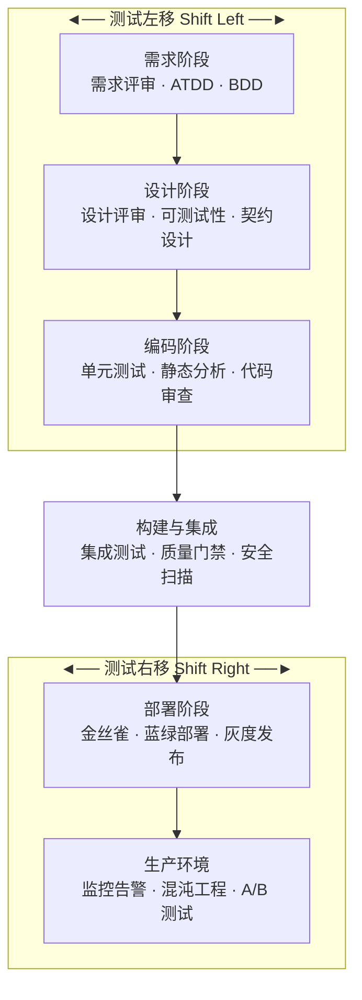

# 测试左移与右移教程（软件测试人员专用）

> 本教程面向软件测试工程师，系统讲解测试左移（Shift Left）和测试右移（Shift Right）的核心理念与落地实践，覆盖单元测试、静态代码分析、契约测试、CI/CD 质量门禁、生产监控、混沌工程、金丝雀发布等关键场景。

<div class="tutorial-meta">
    <span class="difficulty-badge difficulty-intermediate">📙 进阶难度</span>
    <span class="meta-item">⏱ 约 3 天</span>
    <span class="meta-item">📋 前置：软件测试基础、CI/CD 概念、Python/JS 基础</span>
    <span class="meta-item">🎯 目标：理解并实践测试左移/右移的全流程质量保障</span>
</div>

| 项目 | 要求 | 获取方式 |
|------|------|----------|
| 测试基础 | 了解测试生命周期、用例设计 | [测试基础教程](../基础理论/软件测试理论基础教程.md) |
| CI/CD 概念 | 了解 Jenkins/GitLab CI 基本流程 | [Jenkins 教程](../持续集成/Jenkins-CICD教程-软件测试版.md) |
| Python 基础 | 能写简单 Python 脚本 | [Python 教程](../基础理论/Python基础教程-软件测试版.md) |

---

## 新手导读

测试左移/右移不是要测试人员取代开发或运维，而是在软件生命周期的每个阶段都注入质量意识。

第一遍重点掌握：

1. **左移核心**：尽早发现缺陷，降低修复成本。
2. **右移核心**：持续监控线上质量，快速反馈。
3. **单元测试**：左移的基石，开发人员写，测试人员要能看懂和推动。
4. **CI/CD 质量门禁**：用工具自动化拦截低质量代码。
5. **生产监控**：上线不是终点，而是质量验证的新起点。

不要把左移/右移当成"额外工作"——它是用更少的成本获得更高的质量。

### 版本与维护说明

| 项目 | 说明 |
|------|------|
| 适用范围 | 测试左移/右移理念、单元测试、静态分析、契约测试、CI/CD 质量门禁、生产监控、混沌工程 |
| 使用建议 | 理解理念后，选择 1-2 个实践点在团队中试点 |
| 更新提醒 | 工具版本、CI 平台功能会变化，使用前查阅官方文档 |

---

## 一、什么是测试左移和右移

### 1.1 传统测试的困境

```
传统测试时间线：
需求 → 设计 → 开发 → 【测试】→ 上线 → 运维
                        ↑
                   测试只在这里介入
```

传统模式的问题：

- **缺陷发现太晚**：一个需求阶段的 Bug 在测试阶段才被发现，修复成本是需求阶段的 **30-100 倍**
- **测试时间被压缩**：开发延期，测试周期首当其冲被压缩
- **质量问题归咎测试**："为什么没测出来？"成为测试人员的噩梦

### 1.2 测试左移（Shift Left）

**核心思想**：将测试活动提前到软件生命周期的早期阶段。


> 绿色越深 = 介入越早。测试在需求阶段就进场，缺陷修复成本最低。

左移的关键实践：

- **需求评审参与**：测试人员提前发现需求歧义和遗漏
- **设计评审**：检查可测试性、异常场景覆盖
- **单元测试**：开发编写，测试推动覆盖率
- **静态代码分析**：自动化检测代码质量问题
- **契约测试**：微服务间的接口约定提前验证

### 1.3 测试右移（Shift Right）

**核心思想**：将质量保障延伸到生产环境，持续监控和验证。


> 蓝色越深 = 越靠近生产。上线不是终点，而是质量验证的新起点。

右移的关键实践：

- **生产监控**：APM、日志分析、错误率监控
- **混沌工程**：主动注入故障验证系统韧性
- **金丝雀发布**：小范围灰度验证
- **A/B 测试**：用数据驱动功能验证

### 1.4 全景图



> **核心公式**：越早发现缺陷，修复成本越低；越晚发现影响，监控反馈越快。

---

## 二、单元测试（左移基础）

### 2.1 为什么测试人员要懂单元测试

单元测试是左移的基石。测试人员不需要写所有单元测试，但需要：

- **推动覆盖率**：设定覆盖率目标并追踪
- **审查测试质量**：检查单元测试是否覆盖了关键场景
- **补充边界测试**：开发可能遗漏的边界和异常场景

### 2.2 Pytest 基础

#### 安装与第一个测试

```bash
pip install pytest pytest-cov
```

```python
# test_sample.py
def test_addition():
    assert 1 + 1 == 2

def test_string():
    assert "hello".upper() == "HELLO"
```

运行测试：

```bash
pytest test_sample.py -v
```

#### Fixture（测试夹具）

Fixture 用于准备测试环境和数据，是 Pytest 最强大的特性之一：

```python
import pytest

@pytest.fixture
def sample_user():
    """提供测试用户数据"""
    return {
        "username": "testuser",
        "password": "Test@1234",
        "email": "test@example.com"
    }

@pytest.fixture
def db_connection():
    """提供数据库连接，测试后自动清理"""
    conn = create_connection()
    yield conn          # yield 之前是 setup，之后是 teardown
    conn.close()

def test_user_creation(sample_user):
    user = create_user(sample_user)
    assert user.username == "testuser"

def test_db_query(db_connection):
    result = db_connection.execute("SELECT 1")
    assert result is not None
```

#### 参数化测试

一组测试逻辑，多组数据：

```python
import pytest

@pytest.mark.parametrize("username, password, expected", [
    ("admin", "Admin@123", True),       # 正确凭据
    ("admin", "wrong", False),           # 错误密码
    ("", "Admin@123", False),            # 空用户名
    ("admin", "", False),                # 空密码
    ("admin' OR 1=1--", "x", False),     # SQL 注入尝试
])
def test_login(username, password, expected):
    result = authenticate(username, password)
    assert result.success == expected
```

#### Mark 标记

```python
import pytest

@pytest.mark.slow
def test_large_data_processing():
    """标记为慢测试，可选择性跳过"""
    pass

@pytest.mark.skip(reason="接口暂未实现")
def test_future_feature():
    pass

@pytest.mark.parametrize("browser", ["chrome", "firefox", "edge"])
def test_cross_browser(browser):
    """跨浏览器测试"""
    pass
```

运行时按标记筛选：

```bash
pytest -m "not slow"          # 跳过慢测试
pytest -m slow                # 只运行慢测试
```

### 2.3 测试覆盖率

```bash
# 运行测试并生成覆盖率报告
pytest --cov=myapp --cov-report=html --cov-report=term
```

```terminal
Name                  Stmts   Miss  Cover
-----------------------------------------
myapp/auth.py            50      8    84%
myapp/models.py          30      2    93%
myapp/views.py           80     20    75%
-----------------------------------------
TOTAL                   160     30    81%
```

覆盖率目标建议：
| 覆盖率 | 评价 | 建议 |
|--------|------|------|
| < 50% | 危险 | 立即补充核心路径测试 |
| 50-70% | 一般 | 重点补充异常分支 |
| 70-80% | 良好 | 多数团队的合理目标 |
| > 90% | 优秀 | 核心模块追求此目标 |

> **注意**：覆盖率高不代表测试质量高。100% 覆盖率但全是 `assert True` 毫无意义。关注**有效覆盖率**。

### 2.4 AAA 模式（Arrange-Act-Assert）

每个单元测试应遵循三步结构：

```python
def test_transfer_insufficient_balance():
    # Arrange（准备）：设置测试数据和环境
    account = BankAccount(balance=100)
    target = BankAccount(balance=50)

    # Act（执行）：调用被测功能
    result = account.transfer(target, amount=200)

    # Assert（断言）：验证结果
    assert result.success is False
    assert account.balance == 100       # 余额不变
    assert target.balance == 50          # 目标也不变
```

### 2.5 实战：为登录函数写单元测试

**被测代码**：

```python
# auth.py
import re

class AuthenticationError(Exception):
    pass

def validate_password(password):
    """密码强度校验"""
    if len(password) < 8:
        return False, "密码长度不能少于8位"
    if not re.search(r'[A-Z]', password):
        return False, "密码必须包含大写字母"
    if not re.search(r'[0-9]', password):
        return False, "密码必须包含数字"
    return True, "密码符合要求"

def login(username, password, user_db):
    """登录函数"""
    if not username or not password:
        raise AuthenticationError("用户名和密码不能为空")

    valid, msg = validate_password(password)
    if not valid:
        raise AuthenticationError(msg)

    user = user_db.get(username)
    if not user:
        raise AuthenticationError("用户不存在")

    if user["password"] != password:
        raise AuthenticationError("密码错误")

    if not user.get("active", True):
        raise AuthenticationError("账户已被禁用")

    return {"token": f"token_{username}", "role": user.get("role", "user")}
```

**完整单元测试**：

```python
# test_auth.py
import pytest
from auth import login, validate_password, AuthenticationError

# ---- Fixture ----
@pytest.fixture
def user_db():
    return {
        "alice": {"password": "Alice@123", "role": "admin", "active": True},
        "bob":   {"password": "Bob@12345", "role": "user",  "active": True},
        "charlie": {"password": "Charlie@1", "role": "user", "active": False},
    }

# ---- 密码强度测试（参数化） ----
@pytest.mark.parametrize("password, expected_valid, expected_msg", [
    ("Abc@1234",   True,  "密码符合要求"),
    ("short",      False, "密码长度不能少于8位"),
    ("alllowercase1", False, "密码必须包含大写字母"),
    ("ALLUPPERCASE",  False, "密码必须包含数字"),
    ("",           False, "密码长度不能少于8位"),
    ("12345678",   False, "密码必须包含大写字母"),
])
def test_validate_password(password, expected_valid, expected_msg):
    valid, msg = validate_password(password)
    assert valid == expected_valid
    assert msg == expected_msg

# ---- 登录成功测试 ----
def test_login_success(user_db):
    # Arrange
    # Act
    result = login("alice", "Alice@123", user_db)
    # Assert
    assert "token" in result
    assert result["role"] == "admin"

# ---- 登录失败测试（参数化） ----
@pytest.mark.parametrize("username, password, expected_error", [
    ("alice", "wrongpwd",     "密码错误"),
    ("nobody", "Abc@1234",    "用户不存在"),
    ("",       "Abc@1234",    "用户名和密码不能为空"),
    ("alice",  "",            "用户名和密码不能为空"),
    ("charlie","Charlie@1",   "账户已被禁用"),
    ("alice",  "short",       "密码长度不能少于8位"),
])
def test_login_failure(username, password, expected_error, user_db):
    with pytest.raises(AuthenticationError, match=expected_error):
        login(username, password, user_db)

# ---- 边界测试 ----
def test_login_returns_token_format(user_db):
    result = login("bob", "Bob@12345", user_db)
    assert result["token"].startswith("token_")
    assert result["token"] == "token_bob"
```

---

## 三、静态代码分析（左移）

### 3.1 什么是静态分析

静态分析不运行代码，而是通过扫描源码发现潜在问题：

- 代码风格不一致
- 潜在 Bug（未使用的变量、空指针引用）
- 安全漏洞（硬编码密码、SQL 拼接）
- 代码复杂度过高

### 3.2 Python 静态分析工具

#### pylint — 全面检查

```bash
pip install pylint
pylint myapp/ --output-format=text
```

```terminal
************* Module myapp.auth
myapp/auth.py:15:0: C0114: Missing module docstring (missing-module-docstring)
myapp/auth.py:22:4: W0612: Unused variable 'result' (unused-variable)
myapp/auth.py:30:0: C0116: Missing function or method docstring (missing-function-docstring)
myapp/auth.py:45:12: R1720: No "else" after "raise" (no-else-raise)

-----------------------------------
Your code has been rated at 7.50/10
```

#### flake8 — 轻量快速

```bash
pip install flake8
flake8 myapp/ --max-line-length=120 --statistics
```

#### mypy — 类型检查

```bash
pip install mypy
mypy myapp/ --ignore-missing-imports
```

```python
# mypy 能发现的问题示例
def add(a: int, b: int) -> int:
    return a + b

result = add("hello", "world")  # mypy 报错：Argument 1 has incompatible type "str"; expected "int"
```

### 3.3 JavaScript 静态分析：ESLint

```bash
npm install eslint --save-dev
npx eslint --init
```

```javascript
// .eslintrc.json
{
    "env": { "browser": true, "es2021": true, "node": true },
    "extends": "eslint:recommended",
    "rules": {
        "no-unused-vars": "warn",
        "no-console": "warn",
        "eqeqeq": "error",
        "curly": "error"
    }
}
```

```bash
npx eslint src/ --fix  # 自动修复可修复的问题
```

### 3.4 SonarQube 概念与集成

SonarQube 是企业级代码质量管理平台：

```
┌─────────────────────────────────────────┐
│              SonarQube 架构              │
├─────────────┬───────────────────────────┤
│  CI/CD      │  SonarQube Server         │
│  Pipeline   │  ┌───────────────────┐    │
│             │  │ Quality Gate       │    │
│  SonarScanner──▶│  代码分析引擎     │    │
│             │  │  数据库           │    │
│             │  └───────────────────┘    │
│             │  Dashboard / Reports      │
└─────────────┴───────────────────────────┘
```

SonarQube 关注的维度：

- **Bugs**：代码缺陷
- **Vulnerabilities**：安全漏洞
- **Code Smells**：代码异味
- **Coverage**：测试覆盖率
- **Duplications**：重复代码

### 3.5 CI/CD 中集成静态分析

```yaml
# GitLab CI 示例
stages:
  - lint
  - test
  - quality

python-lint:
  stage: lint
  script:
    - pip install flake8 pylint mypy
    - flake8 src/ --max-line-length=120
    - pylint src/ --fail-under=7.0
    - mypy src/ --ignore-missing-imports
  allow_failure: false   # lint 失败则阻断流水线

js-lint:
  stage: lint
  script:
    - npm ci
    - npx eslint src/ --max-warnings=0
  allow_failure: false

sonarqube-scan:
  stage: quality
  script:
    - sonar-scanner -Dsonar.projectKey=myproject
  allow_failure: false
```

---

## 四、需求评审中的测试参与（左移）

### 4.1 测试人员在需求评审中关注什么

```
开发关注：怎么实现？
产品关注：做什么功能？
测试关注：什么情况下会出错？           ← 这就是测试的视角
```

测试人员在需求评审中应关注：

| 关注维度 | 具体内容 | 示例 |
|----------|----------|------|
| **完整性** | 功能是否有遗漏 | 只说了登录成功，没说登录失败怎么办？ |
| **一致性** | 需求之间是否矛盾 | A 页面说最多上传 5 张，B 页面说 10 张 |
| **可测试性** | 需求是否可验证 | "系统应该快"→ 多快？具体指标？ |
| **边界条件** | 极端情况如何处理 | 上传 0 字节文件？超大文件？ |
| **异常场景** | 异常情况的处理 | 网络断了？并发操作？数据冲突？ |
| **安全合规** | 数据保护和权限 | 密码怎么存储？谁能看谁的数据？ |

### 4.2 需求评审 Checklist

```markdown
## 需求评审 Checklist（测试视角）

### 基本信息
- [ ] 需求文档版本号和日期是否标注
- [ ] 需求优先级是否明确
- [ ] 涉及的系统/模块是否列出

### 功能完整性
- [ ] 主流程是否描述清楚
- [ ] 异常流程是否描述清楚（网络异常、超时、并发）
- [ ] 边界条件是否说明（最大值、最小值、空值）
- [ ] 默认值是否明确
- [ ] 状态流转是否完整（所有状态和转换条件）

### 可测试性
- [ ] 验收标准是否明确、可度量
- [ ] 性能指标是否量化（响应时间 < 2s，并发 1000）
- [ ] 是否有明确的输入输出定义

### 数据相关
- [ ] 数据格式是否定义（长度、类型、校验规则）
- [ ] 数据来源是否明确
- [ ] 历史数据如何处理（兼容性）

### 权限与安全
- [ ] 角色权限矩阵是否明确
- [ ] 敏感数据处理方式是否说明
```

### 4.3 TDD 与 BDD 概念

#### TDD（测试驱动开发）

```
TDD 循环：Red → Green → Refactor

1. Red    ：先写一个会失败的测试
2. Green  ：写最少的代码让测试通过
3. Refactor：重构代码，保持测试通过

        ┌──→ Red ──→ Green ──→ Refactor ──┐
        └──────────────────────────────────┘
```

```python
# TDD 示例：写一个折扣计算函数

# 第一步：先写测试（Red）
def test_discount_vip_user():
    assert calculate_discount(amount=100, user_type="vip") == 80  # 8折

# 第二步：写实现（Green）
def calculate_discount(amount, user_type):
    if user_type == "vip":
        return amount * 0.8
    return amount

# 第三步：重构（补充更多场景）
```

#### BDD（行为驱动开发）

BDD 用自然语言描述行为，让非技术人员也能理解：

```gherkin
# login.feature
Feature: 用户登录
  作为一个注册用户
  我希望能够登录系统
  以便访问我的个人数据

  Scenario: 使用正确的用户名和密码登录
    Given 用户已注册，用户名为 "alice"，密码为 "Alice@123"
    When  用户输入用户名 "alice" 和密码 "Alice@123" 并点击登录
    Then  登录成功，跳转到首页
    And   页面显示 "欢迎回来，alice"

  Scenario: 使用错误密码登录
    Given 用户已注册，用户名为 "alice"，密码为 "Alice@123"
    When  用户输入用户名 "alice" 和密码 "wrong" 并点击登录
    Then  登录失败
    And   页面显示 "用户名或密码错误"
```

```python
# 对应的 Python 测试代码（使用 pytest-bdd）
from pytest_bdd import scenario, given, when, then

@scenario("login.feature", "使用正确的用户名和密码登录")
def test_login_success():
    pass

@given('用户已注册，用户名为 "alice"，密码为 "Alice@123"')
def registered_user(user_db):
    user_db.register("alice", "Alice@123")

@when('用户输入用户名 "alice" 和密码 "Alice@123" 并点击登录')
def do_login(login_page):
    login_page.login("alice", "Alice@123")

@then('登录成功，跳转到首页')
def check_homepage(login_page):
    assert login_page.is_on_homepage()
```

---

## 五、契约测试（左移/微服务）

### 5.1 微服务带来的测试挑战

```
传统单体：[前端] → [后端]        # 一个接口测清楚就行

微服务：  [前端] → [用户服务] → [订单服务] → [支付服务]
                    ↕              ↕              ↕
               [库存服务]       [通知服务]      [风控服务]
```

问题：

- 服务 A 的接口改了，服务 B 不知道，联调才发现
- 集成测试需要启动所有服务，环境搭建复杂
- 接口文档和实际不一致

### 5.2 什么是契约测试

**契约测试**验证服务之间的接口约定（请求/响应格式）是否一致。

```
┌──────────┐    契约（Contract）    ┌──────────┐
│ 消费者   │ ◄──────────────────► │ 提供者   │
│ (Consumer)│  GET /users/1       │ (Provider)│
│          │  响应：{id, name}     │          │
└──────────┘                      └──────────┘

契约测试确保：
- 消费者的期望 = 提供者的承诺
- 任何一方的变更都能被自动检测
```

### 5.3 消费者驱动契约（CDC）

传统方式：提供者定义接口 → 消费者适配
CDC 方式：**消费者定义期望** → 提供者满足契约

```
CDC 流程：
1. 消费者端：编写期望的接口行为（Pact 文件）
2. 将 Pact 文件共享给提供者
3. 提供者端：验证自己的实现是否满足契约
4. CI/CD 中自动运行两端验证
```

### 5.4 Pact 概念与工作流程

```python
# 消费者端测试（生成契约）
from pact import Consumer, Provider

pact = Consumer("OrderService").has_pact_with(Provider("UserService"))
pact.start_service()

# 定义期望
(pact
 .given("用户 1 存在")
 .upon_receiving("获取用户 1 的信息")
 .with_request("GET", "/users/1")
 .will_respond_with(200, body={
     "id": 1,
     "name": "Alice",
     "email": "alice@example.com"
 }))

with pact:
    result = get_user(1)
    assert result["name"] == "Alice"

pact.stop_service()
```

```python
# 提供者端验证
# 运行 Pact 验证，确保提供者满足所有消费者的契约
# pact-verifier --provider-base-url=http://localhost:8080 --pact-url=./pacts/
```

---

## 六、CI/CD 中的质量门禁（左移）

### 6.1 质量门禁是什么

质量门禁是 CI/CD 流水线中的自动化质量检查点，不通过则阻断发布。

```
代码提交 → [Lint 门禁] → [单元测试门禁] → [覆盖率门禁] → [安全扫描] → 部署
              │ 失败        │ 失败           │ 失败         │ 失败
              ▼             ▼               ▼             ▼
            打回修复       打回修复         打回修复       打回修复
```

### 6.2 各阶段门禁配置

#### 阶段一：代码提交时 — Lint + 单元测试

```yaml
# .github/workflows/pr-check.yml
name: PR Quality Check

on: [pull_request]

jobs:
  lint-and-test:
    runs-on: ubuntu-latest
    steps:
      - uses: actions/checkout@v4

      - name: Python Lint
        run: |
          pip install flake8
          flake8 src/ --max-line-length=120 --statistics

      - name: Unit Tests
        run: |
          pip install pytest pytest-cov
          pytest tests/ --cov=src --cov-report=term --cov-fail-under=70
```

#### 阶段二：构建时 — 集成测试 + 覆盖率阈值

```yaml
  integration-test:
    needs: lint-and-test
    runs-on: ubuntu-latest
    services:
      postgres:
        image: postgres:15
        env:
          POSTGRES_PASSWORD: testpass
        ports:
          - 5432:5432

    steps:
      - name: Run Integration Tests
        run: |
          pytest tests/integration/ --cov=src --cov-report=xml
          # 覆盖率低于 60% 则失败

      - name: Upload Coverage
        uses: codecov/codecov-action@v3
```

#### 阶段三：部署前 — 安全扫描 + 性能基准

```yaml
  security-scan:
    needs: integration-test
    runs-on: ubuntu-latest
    steps:
      - name: Dependency Security Scan
        run: |
          pip install safety
          safety check --full-report

      - name: SAST Scan (Semgrep)
        uses: returntocorp/semgrep-action@v1
        with:
          config: p/python

      - name: Performance Baseline
        run: |
          pytest tests/performance/ --benchmark-only
          # 性能回归超过 20% 则失败
```

### 6.3 完整的质量门禁流水线

```
┌─────────────────────────────────────────────────────────────────┐
│                    CI/CD 质量门禁流水线                           │
├──────────┬──────────┬──────────┬──────────┬──────────┬──────────┤
│  Stage 1 │  Stage 2 │  Stage 3 │  Stage 4 │  Stage 5 │  Stage 6 │
│  Lint    │  Unit    │  Integ.  │  SAST    │  Deploy  │  Smoke   │
│          │  Test    │  Test    │  Scan    │  Canary  │  Test    │
├──────────┼──────────┼──────────┼──────────┼──────────┼──────────┤
│ flake8   │ pytest   │ pytest   │ semgrep  │ 5%流量   │ 健康检查 │
│ pylint   │ coverage │ contract │ safety   │ 监控24h  │ 核心接口 │
│ mypy     │ ≥ 70%    │ ≥ 60%    │ sonar    │ 自动回滚 │ E2E      │
└──────────┴──────────┴──────────┴──────────┴──────────┴──────────┘
  ↓ 任一阶段失败，流水线停止，通知开发修复
```

---

## 七、生产环境监控（右移）

### 7.1 为什么需要右移

```
测试环境 ≠ 生产环境

测试环境的局限：
- 数据量小（100 条 vs 100 万条）
- 并发低（10 用户 vs 10 万用户）
- 环境差异（网络、存储、第三方服务）
- 某些 Bug 只在特定条件下触发
```

### 7.2 Prometheus + Grafana 概念

```
┌─────────────────────────────────────────────┐
│              监控架构                        │
│                                             │
│  应用 ──metrics──→ Prometheus ──→ Grafana   │
│   │                    │            │       │
│   │                    ▼            ▼       │
│   │              数据存储         可视化面板  │
│   │              (TSDB)          Dashboard  │
│   │                    │                    │
│   │                    ▼                    │
│   │              AlertManager               │
│   │                    │                    │
│   └── 日志 ──→ Loki ──→ 告警通知            │
│                  │      (邮件/钉钉/企微)     │
│                  ▼                          │
│              Grafana                        │
└─────────────────────────────────────────────┘
```

**Prometheus**：时序数据库，采集和存储指标数据
**Grafana**：可视化面板，将数据变成图表
**AlertManager**：告警管理，根据规则发送通知

### 7.3 关键监控指标

#### 四个黄金信号（Google SRE）

| 信号 | 含义 | 示例指标 |
|------|------|----------|
| **延迟** | 请求处理时间 | P50、P95、P99 响应时间 |
| **流量** | 系统请求量 | QPS、TPS |
| **错误率** | 失败请求比例 | HTTP 5xx 比率 |
| **饱和度** | 资源使用程度 | CPU、内存、磁盘使用率 |

#### 告警规则示例

```yaml
# Prometheus 告警规则
groups:
  - name: application_alerts
    rules:
      # 错误率超过 5% 持续 5 分钟
      - alert: HighErrorRate
        expr: |
          sum(rate(http_requests_total{status=~"5.."}[5m]))
          /
          sum(rate(http_requests_total[5m])) > 0.05
        for: 5m
        labels:
          severity: critical
        annotations:
          summary: "错误率超过 5%"
          description: "当前错误率 {{ $value | humanizePercentage }}"

      # P99 响应时间超过 2 秒
      - alert: HighLatency
        expr: |
          histogram_quantile(0.99, sum(rate(http_request_duration_seconds_bucket[5m]))) > 2
        for: 5m
        labels:
          severity: warning
        annotations:
          summary: "P99 响应时间超过 2 秒"

      # CPU 使用率超过 80%
      - alert: HighCPU
        expr: node_cpu_seconds_total > 0.8
        for: 10m
        labels:
          severity: warning
```

### 7.4 应用性能监控（APM）

APM 工具提供端到端的性能追踪：

```
用户请求 → 网关 → 用户服务 → 数据库
   │         │        │          │
   └─────────┴────────┴──────────┘
         APM 追踪全链路耗时

APM 能告诉你：
- 一个请求经过了哪些服务
- 每个服务花了多少时间
- 最慢的环节在哪里
- 数据库查询是否命中索引
```

常用 APM 工具：

- **SkyWalking**：开源，Java/Python/Go 支持好
- **Jaeger**：Uber 开源，分布式追踪
- **Datadog**：商业 SaaS，功能全面
- **New Relic**：商业 SaaS，易用

---

## 八、混沌工程（右移）

### 8.1 什么是混沌工程

**混沌工程** = 在生产/预生产环境中有计划地注入故障，验证系统在异常条件下的韧性。

```
核心理念：与其等待故障发生时手忙脚乱，不如主动制造故障来验证系统的容错能力。

传统思维："系统没出过问题，应该没问题"
混沌思维："我们主动制造问题，看看系统能不能扛住"
```

### 8.2 故障注入类型

| 故障类型 | 说明 | 影响 | 示例 |
|----------|------|------|------|
| **网络延迟** | 模拟网络变慢 | 响应变慢、超时 | 服务间通信增加 2s 延迟 |
| **网络丢包** | 模拟网络不稳定 | 请求失败 | 10% 的请求被丢弃 |
| **服务宕机** | 模拟进程崩溃 | 服务不可用 | 杀死某个服务的 Pod |
| **CPU 满载** | 模拟 CPU 资源不足 | 处理变慢 | CPU 压力到 90% |
| **磁盘满** | 模拟磁盘空间不足 | 写入失败 | 日志写入失败 |
| **DNS 故障** | 模拟 DNS 解析失败 | 服务发现失败 | DNS 查询超时 |

### 8.3 混沌工程工具

#### ChaosBlade（阿里开源）

```bash
# 安装 ChaosBlade
wget https://github.com/chaosblade-io/chaosblade/releases/download/v1.7.2/chaosblade-1.7.2-linux-amd64.tar.gz
tar -xzf chaosblade-1.7.2-linux-amd64.tar.gz

# 注入网络延迟
blade create network delay --time 3000 --interface eth0 --remote-port 8080

# 注入 CPU 压力
blade create cpu fullload --cpu-percent 80

# 注入进程杀死
blade create process kill --process java

# 恢复
blade destroy <uid>
```

#### Chaos Mesh（Kubernetes 原生）

```yaml
# 网络延迟实验
apiVersion: chaos-mesh.org/v1alpha1
kind: NetworkChaos
metadata:
  name: web-delay
spec:
  action: delay
  mode: all
  selector:
    labelSelectors:
      app: order-service
  delay:
    latency: "2s"
    jitter: "500ms"
  duration: "5m"
```

### 8.4 混沌实验流程

```
┌─────────────────────────────────────────────┐
│             混沌实验流程                      │
│                                             │
│  1. 定义稳态假设                              │
│     "订单服务的成功率应该 > 99.9%"            │
│           │                                  │
│           ▼                                  │
│  2. 设计实验                                  │
│     "杀死一个订单服务实例"                    │
│           │                                  │
│           ▼                                  │
│  3. 准备回滚方案                              │
│     "自动重启 + 负载均衡转移"                 │
│           │                                  │
│           ▼                                  │
│  4. 执行实验 + 监控                           │
│     观察成功率、延迟、告警                    │
│           │                                  │
│           ▼                                  │
│  5. 分析结果                                  │
│     假设是否成立？哪些指标异常？              │
│           │                                  │
│           ▼                                  │
│  6. 改进系统                                  │
│     补充容错机制、优化告警                    │
└─────────────────────────────────────────────┘
```

> **重要原则**：混沌实验必须有回滚方案，先在测试/预生产环境验证，再逐步在生产环境执行。

---

## 九、金丝雀发布与蓝绿部署（右移）

### 9.1 金丝雀发布（Canary Release）

**概念**：将新版本先部署到一小部分服务器/用户，验证稳定后再全量发布。

```
金丝雀发布流程：

阶段 1（1% 流量）：
  [新版本 1%] ←── 负载均衡 ──→ [旧版本 99%]
  监控：错误率、延迟、业务指标

阶段 2（10% 流量）：
  [新版本 10%] ←── 负载均衡 ──→ [旧版本 90%]
  继续监控...

阶段 3（50% 流量）：
  [新版本 50%] ←── 负载均衡 ──→ [旧版本 50%]

阶段 4（全量）：
  [新版本 100%]
  发布完成 ✓

任何阶段发现问题 → 自动回滚到旧版本
```

测试人员在金丝雀发布中的角色：

- 定义金丝雀发布的**验证指标**（错误率阈值、延迟阈值）
- 设计灰度阶段的**自动化验证用例**
- 参与**发布验证和回滚决策**

### 9.2 蓝绿部署（Blue-Green Deployment）

```
蓝绿部署：

当前（蓝色环境提供服务）：
  用户 ──→ [蓝色环境 v1.0] ← 当前版本
           [绿色环境 v2.0] ← 新版本部署、测试

切换后（绿色环境提供服务）：
  用户 ──→ [绿色环境 v2.0] ← 切换流量
           [蓝色环境 v1.0] ← 保留，随时回滚

优点：零停机，回滚秒级
缺点：需要双倍资源
```

### 9.3 A/B 测试

**A/B 测试**不同于金丝雀发布——它关注的是**功能效果**而非稳定性。

```
A/B 测试：

用户 A（50%）──→ [版本 A：原有购买按钮]  ──→ 统计转化率
用户 B（50%）──→ [版本 B：新购买按钮样式] ──→ 统计转化率

对比指标：转化率、点击率、停留时间
结论：版本 B 转化率提升 15%，全量发布
```

| 对比项 | 金丝雀发布 | A/B 测试 |
|--------|-----------|---------|
| 目的 | 验证稳定性 | 验证功能效果 |
| 关注指标 | 错误率、延迟 | 转化率、用户行为 |
| 流量分配 | 逐步增加 | 固定比例 |
| 回滚条件 | 技术指标异常 | 效果不达标 |

---

## 十、落地实践

### 10.1 小团队如何开始左移

不需要一步到位，从最容易见效的点开始：

```
落地优先级（推荐顺序）：

第 1 周：┌─────────────────────────────┐
         │ CI 中加入 Lint 检查         │ ← 5 分钟搞定，立竿见影
         └─────────────────────────────┘
第 2 周：┌─────────────────────────────┐
         │ CI 中加入单元测试 + 覆盖率   │ ← 设定 50% 起步
         └─────────────────────────────┘
第 1 月：┌─────────────────────────────┐
         │ 测试参与需求评审             │ ← 带着 Checklist 去
         └─────────────────────────────┘
第 2 月：┌─────────────────────────────┐
         │ 引入 SonarQube              │ ← 代码质量可视化
         └─────────────────────────────┘
第 3 月：┌─────────────────────────────┐
         │ 生产环境基本监控             │ ← Prometheus + Grafana
         └─────────────────────────────┘
```

### 10.2 如何说服团队接受左移

常见阻力与应对：

| 阻力 | 回应 | 数据支撑 |
|------|------|----------|
| "没时间写单元测试" | "写单元测试的时间 < 联调 + 回归的时间" | IBM 研究：缺陷每后移一个阶段，修复成本翻 10 倍 |
| "Lint 太严格，影响效率" | "先 warning 不 block，逐步收紧" | 从 max-warnings=100 开始，每周减 10 |
| "测试为什么要参与需求评审" | "需求阶段发现一个歧义，省掉后面 3 天返工" | 需求缺陷占所有缺陷的 40-60% |
| "监控没必要，功能测试都过了" | "测试环境和生产环境有本质差异" | 线上 30% 的 Bug 在测试环境无法复现 |

**说服策略**：

1. **用数据说话**：统计当前线上 Bug 有多少可以在更早阶段发现
2. **小范围试点**：选一个项目试点，用结果说服
3. **降低门槛**：不要一开始就追求完美，先跑起来
4. **展示 ROI**：左移投入 1 天，省掉后面 5 天的回归和修复

### 10.3 渐进式落地路线图

```
┌─────────────────────────────────────────────────────────────┐
│               测试左移/右移 落地路线图                         │
├─────────────┬─────────────┬──────────────┬──────────────────┤
│  Phase 1    │  Phase 2    │  Phase 3     │  Phase 4         │
│  基础左移    │  深度左移    │  基础右移    │  成熟运营         │
│  （1-2月）   │  （3-4月）   │  （5-6月）   │  （持续）         │
├─────────────┼─────────────┼──────────────┼──────────────────┤
│ CI 加 Lint  │ 需求评审     │ 生产监控     │ 混沌工程          │
│ CI 加单测   │ 静态分析     │ APM 链路追踪 │ 金丝雀发布        │
│ 覆盖率报告  │ 契约测试     │ 告警体系     │ A/B 测试          │
│ 代码审查    │ 安全扫描     │ 日志分析     │ 自动化运维        │
├─────────────┼─────────────┼──────────────┼──────────────────┤
│ 目标：      │ 目标：       │ 目标：       │ 目标：            │
│ 自动化基本  │ 早期质量     │ 线上质量     │ 全面质量          │
│ 质量检查    │ 保障体系     │ 保障体系     │ 保障体系          │
└─────────────┴─────────────┴──────────────┴──────────────────┘
```

### 10.4 关键成功因素

1. **领导支持**：左移需要开发配合，需要管理层推动
2. **度量先行**：先统计当前的缺陷分布、修复成本，用数据推动变革
3. **工具自动化**：手动的左移不可持续，一定要自动化
4. **渐进推进**：不要一次性引入所有实践，选 1-2 个先做
5. **文化转变**：质量是整个团队的事，不只是测试团队的事

### 10.5 左移/右移常见误区

| 误区 | 正确理解 |
|------|----------|
| "左移就是让测试写代码" | 左移是让测试更早参与质量活动，不是替代开发 |
| "右移就是运维的事" | 右移需要测试参与监控指标定义和线上验证 |
| "有了自动化就不需要手工测试" | 探索性测试、用户体验测试仍需手工 |
| "覆盖率 100% 就是好" | 覆盖率 ≠ 质量，关注测试有效性 |
| "一次到位搞全套" | 渐进式落地，每一步都产生价值 |
| "左移了就不用系统测试了" | 左移减少但不消除后期测试的需求 |

---

## 十一、可观测性统一框架（OpenTelemetry）

!!! abstract "2025 年可观测性事实标准"
    OpenTelemetry（OTel）是 CNCF 孵化项目，统一了 Traces、Metrics、Logs 三大信号的采集标准，已成为可观测性领域的事实标准。

### 11.1 可观测性三大支柱

| 支柱 | 定义 | 工具 | 用途 |
|------|------|------|------|
| **Metrics（指标）** | 数值型时间序列数据 | Prometheus、Grafana | CPU/内存/请求量/错误率监控 |
| **Logs（日志）** | 离散事件记录 | Loki、ELK、ClickHouse | 错误排查、审计追踪 |
| **Traces（链路追踪）** | 请求在分布式系统中的完整路径 | Jaeger、Zipkin、Tempo | 微服务间调用链分析 |

> **关键区别：** Metrics 告诉你"有问题"，Logs 告诉你"什么问题"，Traces 告诉你"问题在哪"。

### 11.2 OpenTelemetry 架构

```text
应用代码 → OTel SDK → OTel Collector → 后端存储
                        ├── Traces → Jaeger / Tempo
                        ├── Metrics → Prometheus / Mimir
                        └── Logs → Loki / Elasticsearch
```

**核心组件：**

| 组件 | 作用 |
|------|------|
| OTel SDK | 嵌入应用代码，自动/手动采集遥测数据 |
| OTel Collector | 接收、处理、导出数据的中间层 |
| OTLP 协议 | OpenTelemetry Protocol，统一数据传输格式 |

### 11.3 实战：Python 应用集成 OTel

```python
# 安装：pip install opentelemetry-distro opentelemetry-exporter-otlp

from opentelemetry import trace
from opentelemetry.sdk.trace import TracerProvider
from opentelemetry.sdk.trace.export import BatchSpanProcessor
from opentelemetry.exporter.otlp.proto.grpc.trace_exporter import OTLPSpanExporter

# 初始化
provider = TracerProvider()
processor = BatchSpanProcessor(OTLPSpanExporter(endpoint="http://collector:4317"))
provider.add_span_processor(processor)
trace.set_tracer_provider(provider)

tracer = trace.get_tracer(__name__)

# 在代码中创建 Span
def process_order(order_id):
    with tracer.start_as_current_span("process_order") as span:
        span.set_attribute("order.id", order_id)
        validate_order(order_id)    # 子 Span 自动创建
        charge_payment(order_id)
```

---

## 十二、AI 辅助的左移/右移实践

!!! abstract "2025 年 AI + 质量工程"
    AI 正在渗透到左移/右移的每个环节，从代码审查到生产监控。

### 12.1 AI 辅助左移

| 实践 | AI 工具 | 说明 |
|------|---------|------|
| AI 代码审查 | CodeRabbit、Copilot PR Review | 自动发现 Bug、安全漏洞、代码异味 |
| AI 需求分析 | ChatGPT / Claude | 从需求文档提取测试点、发现歧义 |
| AI 静态分析 | SonarQube AI、Semgrep | 智能模式匹配，发现传统规则遗漏的问题 |
| AI 测试生成 | Copilot、Cursor | 根据代码自动生成单元测试 |

### 12.2 AI 辅助右移

| 实践 | AI 工具 | 说明 |
|------|---------|------|
| 异常检测 | Datadog Watchdogs、Dynatrace Davis | AI 自动识别指标异常模式 |
| 根因分析 |PagerDuty AIOps、BigPanda | AI 关联告警，自动定位根因 |
| 智能告警 | Grafana ML、New Relic | 动态阈值告警，减少误报 |
| 日志聚类 | Elastic ML、Loki + AI | 自动聚类相似错误，减少噪音 |

### 12.3 实战：AI 驱动的智能告警

```text
传统告警：CPU > 80% 持续 5 分钟 → 告警
问题：阈值固定，容易误报/漏报

AI 告警：学习历史基线，动态调整阈值
- 凌晨 3 点 CPU 60% → 异常（正常应该是 10%）
- 促销日 CPU 80% → 正常（预期高峰）
```

---

## 十三、Feature Flag 驱动的渐进式发布

### 13.1 什么是 Feature Flag

```text
传统发布：代码部署 = 功能上线（耦合）
Feature Flag：代码部署 ≠ 功能上线（解耦）

部署新代码 → 功能默认关闭 → 灰度开启 → 全量放开
```

### 13.2 主流 Feature Flag 工具

| 工具 | 类型 | 特点 |
|------|------|------|
| LaunchDarkly | SaaS | 功能最全，企业级 |
| Unleash | 开源 | 可自部署，社区活跃 |
| Flagsmith | 开源/SaaS | 轻量级，支持 A/B 测试 |
| Firebase Remote Config | 移动端 | Google 生态，App 配置管理 |

### 13.3 Feature Flag 测试策略

| 测试场景 | 测试方法 |
|----------|----------|
| Flag 开启/关闭 | 分别测试两种状态下的功能 |
| 灰度比例 | 验证百分比放量是否正确 |
| 用户分群 | 验证不同用户组看到不同功能 |
| 回滚 | 关闭 Flag 后功能是否正确降级 |
| Flag 组合 | 多个 Flag 同时存在时的交互 |

---

## 十四、混沌工程工具更新

### 14.2 主流混沌工程工具（2025）

| 工具 | 状态 | 适用平台 | 特点 |
|------|------|----------|------|
| **LitmusChaos** | CNCF 孵化 | K8s | 社区活跃，实验丰富 |
| **Chaos Mesh** | CNCF 毕业 | K8s | PingCAP 开源，支持物理机 |
| **AWS Fault Injection Service** | GA | AWS | 原生集成 AWS 服务 |
| ChaosBlade | ⚠️ 停维 | K8s/主机 | 阿里开源，已迁移到 ChaosBlade-X |

> **推荐：** K8s 环境用 LitmusChaos 或 Chaos Mesh，AWS 环境用 FIS。

---

## 本章小结

| 阶段 | 实践 | 工具/方法 | 测试人员角色 |
|------|------|-----------|-------------|
| **需求阶段** | 需求评审、ATDD/BDD | Checklist、Gherkin | 发现歧义、提前设计用例 |
| **设计阶段** | 设计评审、契约设计 | API 文档、Pact | 验证可测试性、接口约定 |
| **编码阶段** | 单元测试、静态分析 | pytest、SonarQube | 推动覆盖率、审查测试质量 |
| **构建阶段** | CI 门禁、集成测试 | Jenkins/GitLab CI | 配置质量门禁、监控结果 |
| **部署阶段** | 金丝雀、蓝绿部署 | K8s、Istio | 定义验证指标、参与发布 |
| **生产阶段** | 监控、混沌工程 | Prometheus、LitmusChaos | 分析线上问题、改进测试 |

> **一句话总结**：测试左移是"预防"，测试右移是"兜底"，两者结合才是完整的质量保障体系。

---

## 动手任务：诊断「左移右移都做了，线上仍然出问题」的失效环节

> 这是本教程的收尾练习。请**独立完成**，不要先看参考答案。目标不是"把左移右移的名词背出来"，而是**从数据里指出哪一环失效了**，并给出可落地的改进方案。

### 任务背景

某团队做了一年"质量左移 + 右移"，形式上都齐了：需求评审有测试参加、CI 上挂了单元测试和覆盖率、生产接了 Prometheus 告警。但上个季度依然出了 **11 起线上故障**，其中 3 起 P1，用户可感知。

季度复盘会上大家都很委屈："流程都走了。"你要做的是：**拿这份季度数据做诊断**，指出**到底哪一环失效了**（是门禁太松、是评审走形式、还是告警没人接），并给出**质量门禁 + 生产监控**两端的改进方案。

### 任务准备

**团队现状（季度数据）：**

| 环节 | 现状指标 | 数据 |
|------|----------|------|
| 需求评审 | 需求评审覆盖率 | 100%（每个需求都有测试参加） |
| 需求评审 | 评审提出的可测试性问题数 | 平均 0.4 个/需求 |
| 需求评审 | 需求变更率（开发启动后变更） | 32% |
| 单元测试 | 行覆盖率 | 78% |
| 单元测试 | **分支覆盖率** | **41%** |
| 单元测试 | 断言密度（断言数/LOC） | 0.8 个/百行 |
| 静态分析 | SonarQube 质量问题 | 阻断级 0 个，严重级 12 个，技术债待清理 380 个 |
| CI 门禁 | 覆盖率阈值 | 行覆盖率 ≥ 70%，**分支覆盖率未设阈值** |
| CI 门禁 | Lint 规则 | 报错即失败，但很多问题 `--fix` 后自动通过 |
| CI 门禁 | 门禁绕过方式 | 允许 `[skip ci]` 与管理员强制合并 |
| CI 门禁 | 本季度绕过次数 | **43 次**（其中 9 次为发布前紧急绕过） |
| 集成测试 | 覆盖的主链路 | 下单、支付（2 条） |
| 集成测试 | 未覆盖的变更链路 | **优惠券叠加、退款异步回调** |
| 部署 | 发布方式 | 全量发布，无灰度、无金丝雀 |
| 生产监控 | 指标覆盖 | CPU / 内存 / QPS / 5xx 错误率 |
| 生产监控 | **业务指标覆盖** | **无**（订单成功率、支付成功率未监控） |
| 生产监控 | 告警规则数 | 17 条 |
| 生产监控 | 本季度告警数 / 有效告警数 | 412 条 / 58 条（有效率 14%） |
| 生产监控 | 告警平均响应时长 | **47 分钟** |
| 事后复盘 | 有复盘的比例 | 100% |
| 事后复盘 | **复盘产出可回归用例的比例** | **18%** |

**本季度 11 起故障的分类记录（脱敏）：**

| 故障 | 现象 | 影响面 | 首次发现方式 | 事后定位到的漏出环节 |
|------|------|--------|--------------|----------------------|
| F-01 | 优惠券叠加导致订单金额为负 | P1，影响 3,200 单 | 用户客诉 | 集成测试未覆盖该链路 |
| F-02 | 退款异步回调重复处理，造成重复退款 | P1，资损 | 财务对账 | 集成测试未覆盖该链路 |
| F-03 | 大促期间下单接口超时（DB 连接池打满） | P1 | 用户客诉 | 未做性能基准、无业务告警 |
| F-04 | 新版本全量发布后首页白屏 | P2 | 用户客诉 | 无灰度、无发布后验证 |
| F-05 | 边界条件 `quantity = 0` 未处理，生成 0 元订单 | P2 | 回归测试 | 分支覆盖率仅 41%，边界未覆盖 |
| F-06 | 权限校验未判断"已离职"状态 | P2 | 安全扫描 | 需求评审未识别权限分支 |
| F-07 ~ F-11 | 另有 5 起：其中 3 起为分支逻辑未覆盖导致的业务异常，2 起为需求变更未同步给测试 | P3 | 用户客诉 / 监控告警 | 分支覆盖不足、需求变更无同步机制 |

**一次典型故障的时间线（F-01，用于第 3 题）：**

```text
10:02  运营配置了「满 100 减 30」与「新人立减 50」两张券
10:15  用户 A 下单 105 元商品，叠加两张券 → 订单金额 -5 元，系统允许提交
10:15  用户 A 客诉（第一发现渠道是用户，不是监控）
10:40  值班同学看到客诉工单，开始排查
11:02  定位到优惠券叠加逻辑（耗时 22 分钟，无 traceId 关联，全靠人工对日志）
11:20  回滚优惠券配置（影响时长约 78 分钟）
```

### 任务要求

请依次完成，并**保留分析与数据**：

1. **给 11 起故障归因**：按"漏出环节"分类，做一张「漏出环节 → 故障数 → 占比」统计表，指出**故障最集中的前两个环节**。
2. **诊断每一环是否真的生效**：对"需求评审 / 单元测试 / 静态分析 / CI 门禁 / 集成测试 / 部署 / 生产监控 / 复盘"八个环节，逐个用上表数据判断"是**形同虚设**、**部分生效**还是**有效**"，并写出你的判据（必须引用具体数字）。
3. **聚焦最关键的一环做深挖**：从第 2 题里选出**失效最严重**的一环，结合 F-01 的时间线，写清"如果这一环有效，故障会在哪个时间点、被谁、以什么方式拦住"，并把**时间差**算出来。
4. **给出可复用产出**：输出一份**改进方案**，必须包含 ① 质量门禁的具体阈值与配置（至少一段可直接落到 CI 的配置片段）；② 生产监控要新增的**业务指标**与告警规则（含阈值、持续时间、动作）；③ 用"指标 → 当前值 → 目标值 → 验证方式"的表格把改进**可度量**。

### 提交物

| 产出 | 要求 |
|------|------|
| 故障归因表 | 漏出环节 / 故障数 / 占比，按故障数降序 |
| 八环节诊断表 | 环节 / 判据（引用数字）/ 形同虚设·部分生效·有效 / 一句话理由 |
| 关键环节深挖 | F-01 时间线对照：当前时间线 vs 该环有效时的时间线，含拦截时间差 |
| 质量门禁方案 | 阈值表 + 至少一段可用的 CI 配置片段 |
| 生产监控方案 | 业务指标清单 + 告警规则（阈值 / 持续时长 / 动作） |
| 度量表 | 指标 / 当前值 / 目标值 / 验证方式 |

### 完成标准

- [ ] 能用"覆盖率 / 门禁绕过次数 / 告警有效率 / 复盘转化率"这类**执行力数据**判断一个环节是真做了还是走形式
- [ ] 能指出"行覆盖率 78% 但分支覆盖率 41%"意味着边界与条件分支几乎没被测到
- [ ] 能设计 CI 质量门禁的具体阈值，并知道门禁必须**不可绕过**才有意义
- [ ] 能区分"技术指标监控"（CPU / QPS / 5xx）与"业务指标监控"（下单成功率 / 支付成功率），并说明后者为什么是右移的关键
- [ ] 能针对告警 14% 有效率给出降噪方案，而不是简单"多加几条告警"
- [ ] 产出的方案每一项都有可度量的目标值和验证方式

??? tip "参考答案与思路（先自己做完再看）"

    **第 1 题：故障归因**

    | 漏出环节 | 故障数 | 占比 |
    |----------|--------|------|
    | 分支 / 边界覆盖不足（单元 + 集成） | 4 | 36% |
    | 集成测试未覆盖变更链路 | 2 | 18% |
    | 需求变更未同步给测试 | 2 | 18% |
    | 需求评审未识别可测试性 / 权限分支 | 1 | 9% |
    | 无性能基准 + 无业务告警 | 1 | 9% |
    | 无灰度 + 无发布后验证 | 1 | 9% |

    其中 4 起的明细是：F-05（`quantity = 0`）、F-06（离职状态）、F-07 ~ F-11 中的 3 起分支逻辑未覆盖。

    结论：**最集中的两个环节是「分支 / 边界覆盖不足」与「集成测试未覆盖变更链路」**——两者合计 6 起（55%），都是"左移做了但没做到位"的典型；而 F-01 / F-04 的第一发现渠道是**用户客诉**，说明右移也没兜住。

    **第 2 题：八环节诊断**

    | 环节 | 判据（引用数据） | 判定 | 一句话理由 |
    |------|------------------|------|-----------|
    | 需求评审 | 覆盖率 100%，但平均只提 0.4 个问题；需求变更率 32% | **形同虚设** | 参加了但没产出，变更率 32% 说明评审没把歧义挡住 |
    | 单元测试 | 行覆盖 78%，**分支覆盖 41%**，断言密度 0.8/百行 | **部分生效** | 行覆盖虚高，分支和断言都不到位，边界必然漏 |
    | 静态分析 | 阻断级 0，但严重级 12、技术债 380 | **部分生效** | 只把"阻断级"卡住了，严重级问题持续堆积 |
    | CI 门禁 | 行覆盖 ≥ 70% 有阈值、**分支无阈值**；本季度绕过 43 次 | **形同虚设** | 阈值片面 + 可绕过，43 次绕过直接抵消门禁价值 |
    | 集成测试 | 只覆盖下单、支付 2 条链路，优惠券 / 退款未覆盖 | **部分生效** | 主链路有覆盖，但**变更最频繁的链路恰恰没覆盖** |
    | 部署 | 全量发布，无灰度 / 金丝雀 | **形同虚设** | 出问题只能全量回滚，F-04 直接导致全员白屏 |
    | 生产监控 | 只有技术指标，**无业务指标**；告警有效率 14%，响应 47 分钟 | **形同虚设** | 业务故障（订单金额为负）没有任何指标能发现，只能等客诉 |
    | 复盘 | 复盘率 100%，但**转化为回归用例仅 18%** | **部分生效** | 复盘做了，但 82% 的教训没沉淀成用例，同类问题会复发 |

    读法要点：判断"是否形同虚设"看的**不是有没有做，而是有没有产出**——评审覆盖率 100% 但问题数 0.4、门禁存在但绕过 43 次，都属于"仪式性执行"。

    **第 3 题：最深挖一环——生产监控（业务指标缺失）**

    选它的理由：F-01 的**第一发现渠道是用户客诉**，说明整个左移链条漏掉的东西，右移**也没有兜住**。左移和右移双失效，才是"都做了还出事"的本质。

    F-01 时间线对照：

    | 时间 | 实际发生 | 若业务告警有效 |
    |------|----------|----------------|
    | 10:02 | 配置两张券 | 相同 |
    | 10:15 | 产生 -5 元订单，**无人知晓**；同时等来用户客诉 | 「订单金额 < 0」告警触发（分钟级） |
    | 10:40 | 值班同学看到工单才开始排查 | 值班人已在 10:16 收到告警并开始处理 |
    | 11:02 | 定位耗时 22 分钟（无 traceId，人工对日志） | 告警里直接带异常订单号与优惠券组合，定位 ≤ 5 分钟 |
    | 11:20 | 回滚完成，影响 78 分钟 | 回滚 ≤ 20 分钟 |

    ```text
    当前链路耗时：发现 25 分钟（10:15 发生 → 10:40 接手）+ 定位 22 分钟 + 处置 18 分钟
    告警有效后：  发现 ≤ 2 分钟（10:16 告警）+ 定位 ≤ 5 分钟 + 处置 ≤ 15 分钟
    拦截时间差：  约提前 40-55 分钟发现并处置
    ```

    一句话：如果这一环有效，故障会在 **10:16 左右被监控自动发现并直接告警到值班人**，而不是等到 **10:40 才有人接手**；预计影响订单可从 3,200 单压到 200 单以内。

    **第 4 题：改进方案**

    ① 质量门禁（可直接落到 CI）：

    ```yaml
    # .gitlab-ci.yml 片段（Jenkins 用等价的 quality gate 插件）
    stages: [lint, unit_test, integration_test, security]

    unit_test:
      stage: unit_test
      script:
        # 行覆盖与分支覆盖双阈值：分支覆盖必须显式卡住，
        # 否则 78% 的行覆盖会掩盖 41% 的分支覆盖
        - pytest --cov=src --cov-report=xml --cov-report=term --cov-fail-under=75
        - python scripts/check_branch_coverage.py --min-branch 70 --report coverage.xml
        # 只卡"本次变更行"的覆盖率，避免被历史技术债拖死
        - diff-cover coverage.xml --fail-under=80
      rules:
        - if: '$CI_PIPELINE_SOURCE == "merge_request_event"'

    security:
      stage: security
      script:
        - sonar-scanner
        # 让流水线等待质量门结果：严重级问题数冻结在 12，禁止新增
        - echo "quality gate must pass"
    ```

    ```text
    门禁纪律（比配置更关键）：
    - 取消 [skip ci] 权限；仅 release manager 可强制合并，且强制合并必须留痕并进入下次复盘
    - 分支覆盖率阈值从 0 提到 70%，变更行覆盖率 80%
    - 把 Sonar 严重级问题数纳入门禁（当前 12 个，先冻结在 12，禁止新增）
    ```

    ② 生产监控新增业务指标与告警：

    | 业务指标 | 采集方式 | 告警规则 | 动作 |
    |----------|----------|----------|------|
    | 订单金额 ≤ 0 的订单数 | 业务库定时聚合（1 分钟一次） | 大于 0 持续 1 分钟 | 立即告警值班群 + 自动暂停优惠券配置 |
    | 下单成功率（成功/请求） | 应用埋点 + Prometheus | 低于 98% 持续 5 分钟 | 告警 P2 |
    | 支付成功率 | 支付回调埋点 | 低于 97% 持续 5 分钟 | 告警 P2 |
    | 退款回调重复处理次数 | 幂等键重复计数 | 大于 0 立即 | 告警 P1 + 冻结退款任务 |
    | 下单接口 P95 延迟 | Prometheus histogram | 大于 800ms 持续 3 分钟 | 告警 P2 |
    | 发布后 5 分钟错误率 | 发布事件触发采集 | 新版本错误率超过旧版本 2 倍 | 进入回滚候选 |

    告警降噪（针对 14% 有效率）：目标是**把 412 条降下来**，而不是再加。做法是——**分级**（P1 电话 / P2 群 / P3 日报）、**合并**（同源告警 5 分钟聚合）、**动态阈值**（用历史基线替代固定阈值）、**清理**（连续 30 天零命中的规则直接下线）。

    ③ 度量表：

    | 指标 | 当前值 | 目标值 | 验证方式 |
    |------|--------|--------|----------|
    | 分支覆盖率 | 41% | ≥ 70% | CI 门禁输出 |
    | 门禁绕过次数 / 季 | 43 | 0（有审批记录 ≤ 3） | CI 审计日志 |
    | 告警有效率 | 14% | ≥ 60% | 告警平台统计 |
    | 告警平均响应时长 | 47 分钟 | ≤ 10 分钟 | 告警平台统计 |
    | 故障平均发现时长 | 25 分钟（用户客诉） | ≤ 3 分钟（监控） | 故障复盘记录 |
    | 复盘转回归用例率 | 18% | ≥ 80% | 用例库比对 |
    | 变更链路集成覆盖率 | 2/4 条 | 100% | 集成测试清单 |
### 推荐下一步

根据你的学习进度，选择下一步：

1. **如果你想落地 CI 门禁**：学习 [Jenkins CI/CD](../持续集成/Jenkins-CICD教程-软件测试版.md)，把左移实践接到流水线
2. **如果你想做专项深化**：学习 [JMeter 性能测试](JMeter性能测试教程-软件测试版.md) 或 [Web 安全测试](Web安全测试教程-软件测试版.md)
3. **如果你想结合 AI 提效**：学习 [AI 辅助测试](AI辅助测试教程-软件测试版.md)，加速各阶段的测试产出

### 阶段测验

完成教程后，建议做 [测试左右移测验](测试左右移测验.md) 检验学习效果。

### 通关检查

完成本阶段后，使用 [第3阶段-专项测试通关](../学习中心/第3阶段-专项测试通关.md) 检查是否可以进入下一阶段。
