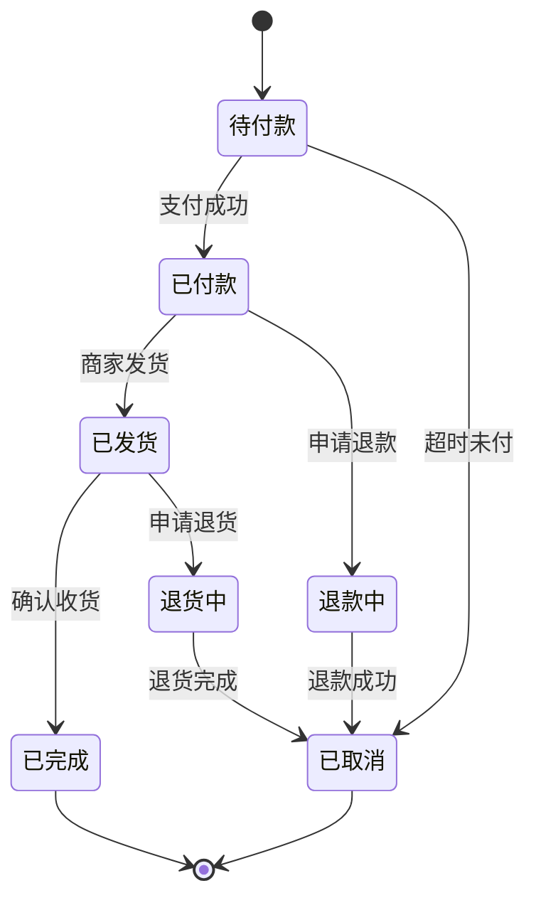
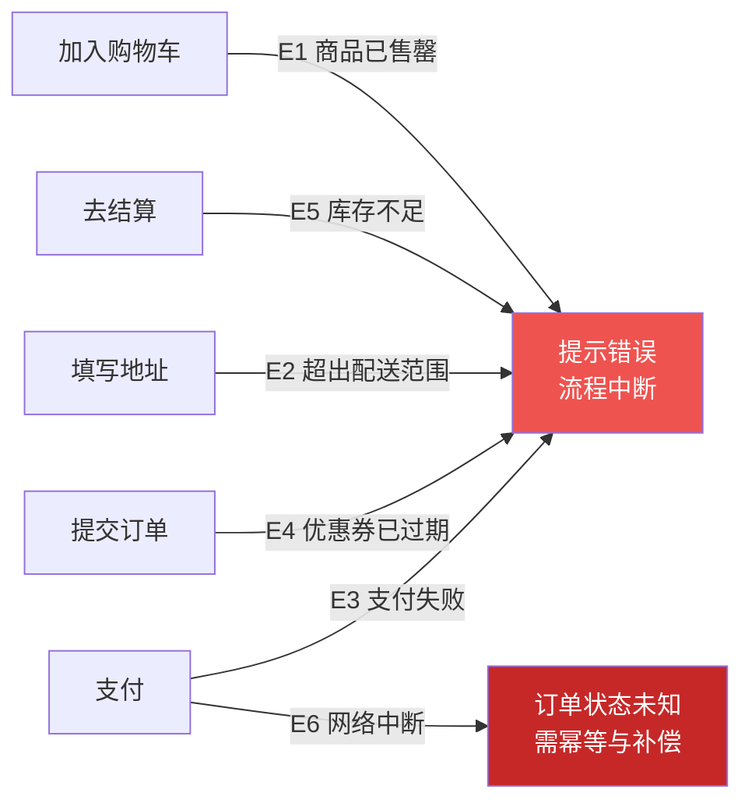
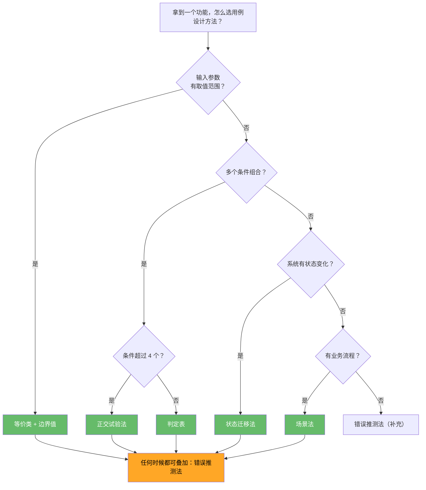

# 测试用例设计方法论教程（软件测试人员专用）

> 本教程面向软件测试工程师，系统讲解测试用例设计方法，从等价类划分、边界值分析到判定表、状态迁移、正交试验，帮助你用更少的用例覆盖更多场景。

<div class="tutorial-meta">
    <span class="difficulty-badge difficulty-intermediate">📙 进阶难度</span>
    <span class="meta-item">⏱ 约 2 天</span>
    <span class="meta-item">📋 前置：软件测试理论基础</span>
    <span class="meta-item">🎯 目标：掌握 7 种经典用例设计方法并能组合使用</span>
</div>

---

## 前置要求

| 项目 | 要求 | 获取方式 |
|------|------|----------|
| 软件测试理论基础 | 了解测试流程、用例设计、缺陷管理 | [软件测试理论基础教程](软件测试理论基础教程.md) |

---

## 新手导读

很多新手写用例靠"拍脑袋"——想到什么测什么。这种方式的问题是：容易遗漏关键场景，也容易重复测试不重要的地方。

系统化的用例设计方法能帮你：

1. **更全面**：不遗漏重要场景。
2. **更高效**：用更少的用例覆盖更多情况。
3. **更专业**：面试和工作中展示你的方法论。

第一遍先记住：

```text
等价类划分：把输入分成"等价"的组，每组测一个代表。
边界值分析：重点测边界（最小值、最大值附近）。
判定表：多个条件组合时，用表格穷举。
状态迁移：有状态变化的系统，测状态流转。
正交试验：太多因素组合时，用最少用例覆盖两两组合。
```

---

## 一、为什么需要系统化的用例设计方法

### 1.1 拍脑袋设计的缺点

```text
场景：测试一个"年龄"输入框（要求 1-120 的整数）

拍脑袋的测试：
- 输入 25 → 通过 ✓
- 输入 100 → 通过 ✓

问题：
- 没测 0、-1（下边界外）
- 没测 121（上边界外）
- 没测 1、120（边界值）
- 没测小数、字母、空值、超长数字
```

### 1.2 方法论的价值

| 方法 | 适用场景 | 核心思想 |
|------|----------|----------|
| 等价类划分 | 输入参数有取值范围 | 分组，每组测一个 |
| 边界值分析 | 输入参数有上下限 | 重点测边界 |
| 判定表 | 多个条件组合 | 穷举所有组合 |
| 状态迁移 | 系统有状态变化 | 测状态流转路径 |
| 正交试验 | 因素太多无法穷举 | 两两组合覆盖 |
| 错误推测法 | 任何场景 | 基于经验猜 Bug |
| 场景法 | 有业务流程 | 测基本流+备选流 |

---

## 二、等价类划分

### 2.1 什么是等价类

把所有可能的输入分成若干组（等价类），从每组中取一个代表来测试。假设：如果一个值能通过测试，同组的其他值大概率也能通过。

```text
两种等价类：
- 有效等价类：符合要求的输入（应该通过）
- 无效等价类：不符合要求的输入（应该报错）
```

### 2.2 实战：注册表单

需求：用户注册，年龄要求 1-120 的整数。

| 等价类 | 输入范围 | 测试值 | 预期结果 |
|--------|----------|--------|----------|
| 有效等价类 | 1-120 的整数 | 25 | 注册成功 |
| 无效等价类（太小） | < 1 | 0 | 提示"年龄必须≥1" |
| 无效等价类（太大） | > 120 | 200 | 提示"年龄必须≤120" |
| 无效等价类（非数字） | 字母/符号 | abc | 提示"请输入数字" |
| 无效等价类（小数） | 小数 | 25.5 | 提示"请输入整数" |
| 无效等价类（空） | 空值 | （空） | 提示"年龄不能为空" |

### 2.3 更多等价类划分示例

| 输入项 | 有效等价类 | 无效等价类 |
|--------|-----------|-----------|
| 手机号（11位） | 13800138000 | 1380013800（10位）、138001380000（12位）、abcdefghijk |
| 密码（8-20位） | Test@123 | Test@1（太短）、空值、纯空格 |
| 邮箱 | test@example.com | test@、@example.com、test |
| 订单金额（>0） | 99.99 | 0、-1、空值 |

---

## 三、边界值分析

### 3.1 什么是边界值

经验表明：Bug 更容易出现在边界上。边界值分析法要求在等价类的边界附近取值测试。

```text
边界值选取规则（以范围 [min, max] 为例）：

min - 1  →  刚好低于下限（应报错）
min      →  刚好等于下限（应通过）  ← 边界
min + 1  →  刚好高于下限（应通过）
max - 1  →  刚好低于上限（应通过）
max      →  刚好等于上限（应通过）  ← 边界
max + 1  →  刚好高于上限（应报错）
```

### 3.2 实战：商品数量输入框

需求：购买数量要求 1-999 的整数。

| 边界值 | 输入 | 预期结果 | 测试类型 |
|--------|------|----------|----------|
| min - 1 | 0 | 提示"最少购买1件" | 无效边界 |
| min | 1 | 添加成功 | 有效边界 |
| min + 1 | 2 | 添加成功 | 有效内部 |
| max - 1 | 998 | 添加成功 | 有效内部 |
| max | 999 | 添加成功 | 有效边界 |
| max + 1 | 1000 | 提示"最多购买999件" | 无效边界 |

### 3.3 常见边界陷阱

| 场景 | 容易遗漏的边界值 |
|------|------------------|
| 数值范围 | 0、-1、最大值、最小值 |
| 字符串长度 | 空字符串、单字符、最大长度、超长 |
| 列表/数组 | 空列表、单元素、满页、翻页 |
| 日期 | 月末、年末、闰年2月29日、跨时区 |
| 分页 | 第1页、最后一页、超出页码 |

---

## 四、判定表（因果图）

### 4.1 什么是判定表

当多个条件组合决定一个结果时，用判定表穷举所有可能的组合，确保不遗漏。

```text
判定表的四个部分：
- 条件（Condition）：输入条件，如"是否VIP"
- 动作（Action）：输出结果，如"打9折"
- 条件项：每个条件的取值（是/否）
- 动作项：每种组合对应的动作
```

### 4.2 实战：订单折扣规则

需求：

```text
规则：
- VIP 用户且满 200 元 → 打 8 折
- VIP 用户不满 200 元 → 打 9 折
- 非 VIP 且满 200 元 → 打 9.5 折
- 非 VIP 且不满 200 元 → 无折扣
- 以上叠加新人券再减 10 元（仅限首单）
```

**判定表：**

| 规则 | R1 | R2 | R3 | R4 | R5 | R6 |
|------|----|----|----|----|----|----|
| **条件：VIP** | Y | Y | N | N | Y | N |
| **条件：满200元** | Y | N | Y | N | Y | Y |
| **条件：首单** | N | N | N | N | Y | Y |
| **动作：折扣** | 8折 | 9折 | 9.5折 | 无 | 8折 | 9.5折 |
| **动作：减10元** | 否 | 否 | 否 | 否 | 是 | 是 |

### 4.3 判定表简化

当条件项太多时（如 5 个条件 = 2^5 = 32 种组合），可以：

1. **排除不可能的组合**（如"已注销"且"有余额"）。
2. **合并相似规则**（如两个规则只在不影响动作的条件上不同）。
3. **使用正交试验法**替代穷举（见第六节）。

---

## 五、状态迁移法

### 5.1 什么是状态迁移

许多系统有状态变化（如订单、工单、审批流）。状态迁移法通过绘制状态流转图，确保覆盖所有合法的状态转换路径。

```text
三个核心概念：
- 状态（State）：系统当前所处的状态
- 事件（Event）：触发状态变化的操作
- 迁移（Transition）：从一个状态到另一个状态的变化
```

### 5.2 实战：订单状态流转



> 画状态迁移图时，重点检查**每个状态的入边和出边是否完整**，以及是否存在**非法跳转**（例如「已取消 → 已付款」应当被拒绝）。

**状态迁移表：**

| 当前状态 | 事件 | 下一状态 | 测试用例 |
|----------|------|----------|----------|
| 待付款 | 支付成功 | 已付款 | 正常支付流程 |
| 待付款 | 超时未付 | 已取消 | 30分钟未支付自动取消 |
| 已付款 | 商家发货 | 已发货 | 商家后台操作发货 |
| 已付款 | 申请退款 | 退款中 | 付款后立即退款 |
| 已发货 | 确认收货 | 已完成 | 用户点击确认收货 |
| 已发货 | 申请退货 | 退货中 | 收到货后申请退货 |
| 退款中 | 退款成功 | 已取消 | 退款到账 |
| 退货中 | 退货完成 | 已取消 | 退货成功 |

### 5.3 测试覆盖准则

| 覆盖级别 | 要求 | 用例数 |
|----------|------|--------|
| 状态覆盖 | 每个状态至少到达一次 | 最少 |
| 迁移覆盖 | 每条迁移至少走一次 | 推荐 |
| 迁移对覆盖 | 每两个相邻的迁移组合至少走一次 | 更全面 |

### 5.4 状态迁移图画法

```text
画图步骤：
1. 列出所有状态
2. 列出所有事件
3. 用箭头连接：状态A --事件--> 状态B
4. 检查每个状态的入边和出边是否完整
5. 标记起始状态和终止状态
```

---

## 六、正交试验法（Pairwise）

### 6.1 问题：组合爆炸

```text
场景：兼容性测试

因素：
- 浏览器：Chrome、Firefox、Safari、Edge（4种）
- 操作系统：Windows、macOS、Linux（3种）
- 分辨率：1920×1080、1366×768、2560×1440（3种）
- 语言：中文、英文（2种）

穷举：4 × 3 × 3 × 2 = 72 条用例！

问题：时间和资源不允许测 72 条。
```

### 6.2 Pairwise 原理

Pairwise（成对测试）保证每两个因素的任意取值组合至少出现一次。

```text
关键思想：大多数 Bug 由两个因素的交互引起，而不是三个或更多。

Pairwise 用例数：大约 10-15 条（vs 穷举 72 条）
覆盖率：任意两个因素的所有组合都被覆盖
```

### 6.3 实战：兼容性测试

使用 Pairwise 生成的用例（示例）：

| 用例 | 浏览器 | OS | 分辨率 | 语言 |
|------|--------|-------|--------|------|
| 1 | Chrome | Windows | 1920×1080 | 中文 |
| 2 | Chrome | macOS | 1366×768 | 英文 |
| 3 | Chrome | Linux | 2560×1440 | 中文 |
| 4 | Firefox | Windows | 1366×768 | 中文 |
| 5 | Firefox | macOS | 2560×1440 | 英文 |
| 6 | Firefox | Linux | 1920×1080 | 英文 |
| 7 | Safari | Windows | 2560×1440 | 英文 |
| 8 | Safari | macOS | 1920×1080 | 中文 |
| 9 | Safari | Linux | 1366×768 | 中文 |
| 10 | Edge | Windows | 1920×1080 | 英文 |
| 11 | Edge | macOS | 1366×768 | 中文 |
| 12 | Edge | Linux | 2560×1440 | 英文 |

```text
从 72 条缩减到 12 条，节省 83% 的测试工作量！
```

### 6.4 Pairwise 工具

**PICT（微软出品）：**

```bash
# 安装
# Windows: 下载 https://github.com/microsoft/pict/releases
# Linux: apt install pict

# 创建因素文件 factors.txt
cat > factors.txt << EOF
浏览器: Chrome, Firefox, Safari, Edge
操作系统: Windows, macOS, Linux
分辨率: 1920x1080, 1366x768, 2560x1440
语言: 中文, 英文
EOF

# 生成 Pairwise 组合
pict factors.txt
```

**Python 实现：**

```python
# pip install allpairspy
from allpairspy import AllPairs

parameters = [
    ["Chrome", "Firefox", "Safari", "Edge"],
    ["Windows", "macOS", "Linux"],
    ["1920x1080", "1366x768", "2560x1440"],
    ["中文", "英文"],
]

for i, pairs in enumerate(AllPairs(parameters)):
    print(f"用例 {i+1}: {pairs}")
```

---

## 七、错误推测法

### 7.1 什么是错误推测法

基于经验和直觉，推测系统可能在哪里出错，然后针对性地设计测试用例。

!!! tip "经验的价值"
    错误推测法不是"拍脑袋"，而是基于对常见 Bug 模式的了解。有经验的测试人员知道哪些地方最容易出问题。

### 7.2 常见错误模式清单

| 类别 | 常见错误 | 测试方法 |
|------|----------|----------|
| **空值** | 必填项为空 | 提交空表单 |
| **特殊字符** | SQL 注入、XSS | 输入 `<script>`, `' OR 1=1` |
| **超长输入** | 缓冲区溢出 | 输入 10000 字符 |
| **并发** | 重复提交、数据竞争 | 同时点击两次提交 |
| **网络中断** | 请求超时、数据丢失 | 断网后操作 |
| **权限** | 越权访问 | 修改 URL 中的 ID |
| **时间** | 时区、跨天、跨月 | 23:59 操作 |
| **文件** | 超大文件、非法格式 | 上传 100MB 文件 |
| **数字** | 0、负数、溢出、精度 | 输入 0.1 + 0.2 |
| **编码** | 中文、Emoji、特殊编码 | 输入 😀🎉 |

### 7.3 测试人员的"Bug 嗅觉"

```text
当你看到以下场景时，应该提高警惕：

- 金额计算 → 精度问题（0.1 + 0.2 ≠ 0.3）
- 日期处理 → 时区、闰年、跨年
- 文件上传 → 大小限制、格式校验、并发上传
- 分页查询 → 最后一页、空数据、并发翻页
- 搜索功能 → 空格、特殊字符、SQL 注入
- 批量操作 → 部分失败怎么办、中途断网
- 权限控制 → 改 URL 参数能否越权
```

---

## 八、场景法

### 8.1 什么是场景法

场景法从业务流程出发，设计覆盖基本流、备选流和异常流的测试用例。

```text
三种流：
- 基本流（Happy Path）：最正常的流程，一路畅通
- 备选流（Alternative Flow）：有分支但最终成功
- 异常流（Exception Flow）：出错，流程中断
```

### 8.2 实战：电商下单场景

**基本流：**


**备选流：**

```text
A1: 购物车中修改数量
A2: 使用优惠券
A3: 选择不同的收货地址
A4: 支付时切换支付方式
A5: 使用积分抵扣
```

**异常流：**



| 编号 | 异常场景 | 关注点 |
|------|----------|--------|
| E1 | 商品已售罄 | 前端是否仍可加购 |
| E2 | 地址超出配送范围 | 是否在下单前拦截 |
| E3 | 支付失败（余额不足/网络错误） | 订单是否保留、能否重试 |
| E4 | 优惠券已过期 | 是否及时提示并回退金额 |
| E5 | 库存不足（下单时被抢） | 是否避免超卖 |
| E6 | 网络中断，订单状态未知 | 幂等性与最终一致性 |

### 8.3 场景法用例设计

| 用例编号 | 场景 | 步骤 | 预期结果 |
|----------|------|------|----------|
| TC01 | 基本流 | 浏览→加购→结算→付款 | 下单成功 |
| TC02 | 基本流+A1 | 加购后修改数量再结算 | 价格更新，下单成功 |
| TC03 | 基本流+A2 | 使用优惠券下单 | 优惠生效，下单成功 |
| TC04 | 异常流-E1 | 购买已售罄商品 | 提示"商品已售罄" |
| TC05 | 异常流-E3 | 支付时余额不足 | 提示"支付失败"，订单保留 |
| TC06 | 异常流-E5 | 下单时库存被抢 | 提示"库存不足" |

---

## 九、方法选择指南

### 9.1 选择流程



**一句话记忆**：先看「有没有取值范围」，再看「条件要不要组合」，然后看「有没有状态」，最后看「有没有流程」。

### 9.2 方法组合使用

实际项目中，通常需要组合多种方法：

```text
案例：测试一个"优惠券使用"功能

1. 等价类：有效券/无效券/过期券/已用券
2. 边界值：券面额 0.01 元、最大抵扣金额
3. 判定表：VIP+满减+首单+券 的组合
4. 场景法：领券→下单→用券→支付 的完整流程
5. 错误推测法：并发用券、券被撤销后订单状态
```

### 9.3 用例优先级划分

| 优先级 | 定义 | 选择标准 |
|--------|------|----------|
| P0（冒烟） | 核心功能必须通过 | 基本流、关键路径 |
| P1（核心） | 重要功能 | 有效等价类、主要边界值 |
| P2（一般） | 次要功能 | 备选流、次要边界 |
| P3（低优） | 边缘场景 | 无效等价类、异常流、极端组合 |

---

## 动手任务：为一个「不安全」的需求设计用例

> 这是本教程的收尾练习。请**独立完成**，不要先看参考答案。目标不是"用例数量多"，而是**用方法保证覆盖、并暴露需求本身的漏洞**。

### 任务背景

产品给了一个需求，你需要在**不写代码、不跑系统**的前提下，仅凭需求设计出完整的测试用例。注意：**这份需求故意写得有歧义、有遗漏**——能否发现它们，是本次练习的重点。

### 任务数据

需求原文：

```text
【折扣计算规则】
1. 用户结算时，系统根据订单金额自动计算折扣。
2. 订单金额满 100 元打 9 折，满 300 元打 8 折，满 500 元打 7 折。
3. 会员额外享受 95 折（可叠加）。
4. 折扣后的金额保留两位小数。
5. 特殊商品（标注为"不参与折扣"）不参与任何折扣计算。
```

### 任务要求

请依次完成，并**标明每条用例用了哪种设计方法**：

1. **等价类划分**：列出"订单金额"的有效等价类与无效等价类，并说明划分依据。
2. **边界值分析**：针对三档门槛，写出完整的边界值用例（提示：门槛两侧、正好等于、跨档位）。
3. **判定表**：为「是否会员 × 是否含特殊商品 × 金额档位」设计判定表，并说明**条件组合共有多少种**、你实际保留了哪些、为什么。
4. **找出需求漏洞**：列出需求里**没写清楚**的地方（至少 4 处），说明每处会导致什么测试争议。
5. **输出用例集**：给出最终用例表（含编号、方法、输入、预期结果、优先级），并说明你**如何保证没有遗漏**。

### 提交物

| 产出 | 要求 |
|------|------|
| 等价类表 | 有效/无效类各若干条，含依据 |
| 边界值用例 | 覆盖三档门槛的完整边界 |
| 判定表 | 条件、动作、组合数、取舍理由 |
| 需求漏洞清单 | 第 4 题的条目 + 影响 |
| 用例表 | 可直接执行，每条标注所用方法 |
| 结论 | 用 3-5 句话说明：这份需求能否直接开发，必须先澄清什么 |

### 完成标准

- [ ] 边界值覆盖**门槛的三种位置**：刚好不足、刚好达标、刚好跨档
- [ ] 判定表说清了**组合总数**与**为什么可以裁剪**，不是随意挑几行
- [ ] 能指出需求**未定义**的行为（这不是找茬，是不让缺陷在开发后才暴露）
- [ ] 用例表里能看出**方法的使用**，而不是凭感觉罗列

??? tip "参考答案与思路（先自己做完再看）"

    **第 1 题：等价类划分**

    以"订单金额"为例：

    | 类型 | 等价类 | 代表值 | 依据 |
    |------|--------|--------|------|
    | 有效 | 0 < 金额 < 100（无折扣） | 50 | 未达门槛 |
    | 有效 | 100 ≤ 金额 < 300（9 折） | 200 | 第一档 |
    | 有效 | 300 ≤ 金额 < 500（8 折） | 400 | 第二档 |
    | 有效 | 金额 ≥ 500（7 折） | 600 | 第三档 |
    | 无效 | 金额 = 0 | 0 | 空订单 |
    | 无效 | 金额 < 0 | -1 | 不可能出现，但需防御 |
    | 无效 | 金额非数字 | "abc" | 类型错误 |
    | 无效 | 金额超精度 | 99.999 | 超过两位小数 |

    划分依据：**同一等价类内，程序的处理逻辑应当相同**。所以按"落在哪一档折扣"划分，而不是按具体数值。

    **第 2 题：边界值分析**

    三档门槛的边界值（**每档三个位置**）：

    | 门槛 | 刚好不足 | 刚好达标 | 刚好跨档 |
    |------|----------|----------|----------|
    | 100 | 99.99 | **100.00** | 300.00 起进下一档 |
    | 300 | 299.99 | **300.00** | 500.00 起进下一档 |
    | 500 | 499.99 | **500.00** | — |

    完整边界用例：

    | 输入金额 | 预期折扣 | 说明 |
    |----------|----------|------|
    | 99.99 | 无折扣 | 差 1 分不达标（**最易出错的点**） |
    | 100.00 | 9 折 | 刚好达标 |
    | 100.01 | 9 折 | 刚过门槛 |
    | 299.99 | 9 折 | 第二档差 1 分 |
    | 300.00 | 8 折 | 刚好进第二档 |
    | 499.99 | 8 折 | 第三档差 1 分 |
    | 500.00 | 7 折 | 刚好进第三档 |

    特别注意 **99.99 / 299.99 / 499.99** —— 浮点数比较是这里的经典缺陷源（`99.99` 用浮点表示可能有精度误差，导致本不该达标的却达标）。

    另外要补充**折扣后的边界**：金额 100.00 打 9 折 = 90.00；金额 111.11 打 9 折 = 99.999 → **四舍五入为 100.00**。这类"折扣后又回到门槛附近"的情况，也是缺陷高发区。

    **第 3 题：判定表**

    三个条件：

    - C1：是否会员（是/否）
    - C2：是否含特殊商品（是/否）
    - C3：金额档位（4 档）

    组合总数：`2 × 2 × 4 = 16` 种。

    完整判定表（16 行应全覆盖，此处展示前 8 行，其余同理）：

    | 规则 | C1 会员 | C2 含特殊商品 | C3 档位 | 动作：折扣计算 | 优先级 |
    |------|---------|---------------|---------|----------------|--------|
    | 1 | 否 | 否 | <100 | 无折扣 | P2 |
    | 2 | 否 | 否 | 100~299 | 9 折 | P1 |
    | 3 | 否 | 否 | 300~499 | 8 折 | P1 |
    | 4 | 否 | 否 | ≥500 | 7 折 | P1 |
    | 5 | 是 | 否 | <100 | **95 折**（可叠加） | P1 |
    | 6 | 是 | 否 | 100~299 | 9 折 × 95 折 | P1 |
    | 7 | 是 | 否 | 300~499 | 8 折 × 95 折 | P1 |
    | 8 | 是 | 否 | ≥500 | 7 折 × 95 折 | P1 |
    | 9-16 | 任意 | **是** | 任意 | **特殊商品不参与折扣** → 需澄清 | P0 |

    **为什么保留全部 16 行**：本例条件少（3 个）、组合可控，**不应裁剪**。只有当条件超过 4-5 个、组合爆炸时，才考虑用正交试验法裁剪。这是方法选择的关键判断——很多人在没必要的时候就用正交法，反而丢掉了该覆盖的组合。

    **第 4 题：需求漏洞**（这是最有价值的部分）

    | # | 漏洞 | 会导致的争议 |
    |---|------|--------------|
    | 1 | **"可叠加"是乘算还是加算？** | `9折 × 95折 = 8.55折` vs `9折 + 95折 = 8.5折`，结果不同 |
    | 2 | **含特殊商品时，折扣怎么算？** | 是整单不打折，还是仅特殊商品不参与、其余照常？两种理解差很多 |
    | 3 | **"满 100"含不含 100 本身？** | 100.00 是否达标？通常"满"含本数，但要确认 |
    | 4 | **多档位是否可叠加？** | 满 500 时，是只享受 7 折，还是 9 折 8 折 7 折连续叠加？按常识是取最高档 |
    | 5 | **四舍五入的算法与币种精度** | `ROUND_HALF_UP` 还是银行家舍入？两位小数是否指"显示"而非"计算"？ |
    | 6 | **多个特殊商品的价格是否计入门槛** | 若不计入，"满减门槛"的判定基数需要明确 |

    第 1、2 条是**必须澄清才能开发**的——不同理解会算出不同金额，属于需求歧义而非实现问题。

    **第 5 题：用例表（节选）+ 如何保证不遗漏**

    | 编号 | 方法 | 输入（金额/会员/特殊商品） | 预期结果 | 优先级 |
    |------|------|----------------------------|----------|--------|
    | TC-01 | 等价类 | 50 / 否 / 否 | 无折扣 | P2 |
    | TC-02 | 边界值 | 99.99 / 否 / 否 | 无折扣 | P1 |
    | TC-03 | 边界值 | **100.00** / 否 / 否 | 9 折 = 90.00 | P0 |
    | TC-04 | 边界值 | 299.99 / 否 / 否 | 9 折 | P1 |
    | TC-05 | 边界值 | **300.00** / 否 / 否 | 8 折 = 240.00 | P0 |
    | TC-06 | 边界值 | 499.99 / 否 / 否 | 8 折 | P1 |
    | TC-07 | 边界值 | **500.00** / 否 / 否 | 7 折 = 350.00 | P0 |
    | TC-08 | 判定表 | 200 / **是** / 否 | 9 折 × 95 折 = 171.00 | P1 |
    | TC-09 | 判定表 | 200 / 否 / **是** | 待需求澄清 | P0 |
    | TC-10 | 等价类 | 0 / 否 / 否 | 拒绝/无折扣 | P2 |
    | TC-11 | 等价类 | -1 / 否 / 否 | 拒绝，提示非法 | P2 |
    | TC-12 | 错误推测 | 111.11 / 否 / 否 | 9 折 = 99.999 → 100.00 | P2 |

    **保证不遗漏的方法**（三重交叉验证）：

    1. **方法覆盖**：四种方法各产出用例，互不替代（等价类管"类"，边界值管"边"，判定表管"组合"，错误推测管"经验"）。
    2. **判定表逐行核对**：16 行规则每行至少 1 条用例，检查表里是否每行都有对应。
    3. **需求逐条反查**：需求 5 条规则，逐条问"哪条用例验证它"，确保没有规则被漏测。

    第 12 条用"折扣后四舍五入"举例，说明**错误推测法**的价值——它不来自方法论推导，而来自"我见过这类缺陷"的经验。

    **结论**：**这份需求不能直接开发**。必须先澄清"叠加算法"和"特殊商品处理方式"这两个歧义点——它们直接决定实现逻辑和预期结果，如果不等澄清就开发，测试阶段必然产生"是缺陷还是需求理解不同"的争论。**用例设计的第一价值不是写用例，而是在过程中发现需求漏洞。**

---

### 推荐下一步

根据你的学习进度，选择下一步：

1. **如果你想练习用例设计**：学习 [探索式测试教程](探索式测试教程-软件测试版.md)，掌握动态测试思维
2. **如果你想学接口测试**：学习 [接口测试完整教程](../专项测试/接口测试完整教程-软件测试版.md)，将方法论应用到接口
3. **如果你想准备面试**：学习 [软件测试面试题](../面试专题/软件测试面试题.md)，用例设计是面试高频考点

### 阶段测验

完成教程后，建议做 [测试用例设计测验](测试用例设计测验.md) 检验学习效果。

### 通关检查

完成本阶段后，使用 [第1阶段-测试入门通关](../学习中心/第1阶段-测试入门通关.md) 检查是否可以进入下一阶段。
