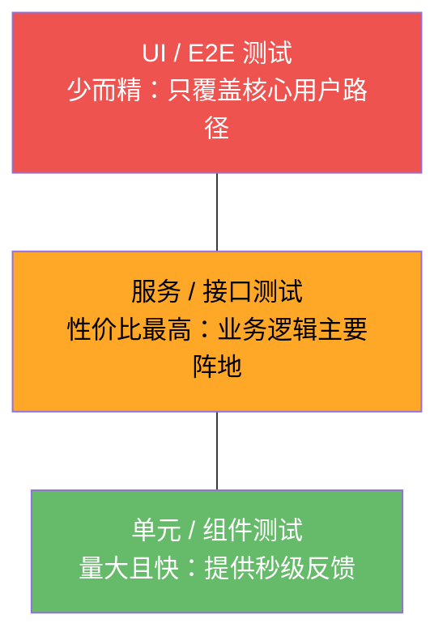
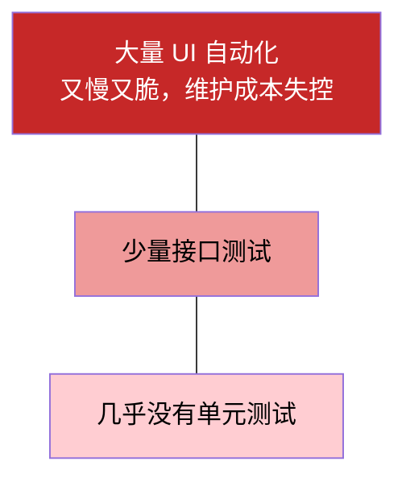

# 测试金字塔与自动化分层策略

!!! abstract "教程简介"
    测试金字塔用于帮助团队决定：哪些测试应该多写，哪些测试应该少写，哪些测试应该手工探索。它不是固定比例公式，而是一种控制测试成本和反馈速度的策略。

---

## 前置要求

| 项目 | 要求 | 获取方式 |
|------|------|----------|
| 软件测试理论基础 | 了解测试分类、测试级别 | [软件测试理论基础教程](../基础理论/软件测试理论基础教程.md) |

---

## 新手导读

很多新手一听自动化，就想直接写 UI 自动化。但真实项目里，如果 UI 自动化太多，常见结果是：运行慢、误报多、维护成本高。测试金字塔就是提醒我们，不要把所有质量保障都压在 UI 层。

第一遍先记住：

```text
单元测试：快，定位准，开发主导。
接口测试：稳定，性价比高，测试常重点参与。
UI 测试：最接近用户，但慢且维护成本高，只覆盖核心流程。
手工探索：发现脚本想不到的问题，不能被自动化完全替代。
```

---

## 一、测试金字塔是什么

经典测试金字塔大致分为三层：



> 越往上：越接近用户，但越慢、越贵、越脆弱；越往下：越快、越便宜、定位越准。

| 层级 | 特点 | 适合覆盖 |
|------|------|----------|
| 单元 / 组件测试 | 快、便宜、定位准 | 函数、类、组件、规则计算 |
| 服务 / 接口测试 | 稳定、性价比高 | 接口业务逻辑、数据流、权限、异常 |
| UI / E2E 测试 | 接近用户、成本高 | 登录、下单、支付前置、核心冒烟 |

金字塔不是要求所有项目都按固定比例写测试，而是提醒：

- 底层测试应该多，提供快速反馈。
- 中层测试覆盖业务逻辑，性价比高。
- 顶层 UI 测试应该精简，覆盖真正关键的用户路径。

---

## 二、为什么不能全靠 UI 自动化

UI 自动化的优点是接近用户真实行为，但它也有明显成本：

| 问题 | 说明 |
|------|------|
| 运行慢 | 打开浏览器、加载页面、等待接口都耗时 |
| 定位脆弱 | 页面结构和文案变化会导致脚本失败 |
| 失败原因复杂 | 可能是前端、后端、网络、数据、环境或脚本问题 |
| 数据准备麻烦 | 下单、支付、权限等场景需要复杂前置数据 |
| 维护成本高 | 页面改版后需要批量修改定位器和断言 |

反模式（倒金字塔 / 冰淇淋筒）：



这种结构下，反馈周期被拉长到小时级，失败原因难以定位，团队成员逐渐不信任自动化结果——这是最常见的自动化失败起点。

这种结构像“倒置金字塔”或“冰淇淋筒”，短期看起来覆盖很多，长期会因为不稳定和维护成本拖垮团队。

---

## 三、每一层应该测什么

### 3.1 单元测试

适合：

- 金额计算。
- 优惠规则。
- 参数转换。
- 日期处理。
- 权限判断函数。
- 状态流转规则。

例子：

```text
优惠券满 100 减 20：
输入金额 99，不能使用。
输入金额 100，可以减 20。
输入金额 101，可以减 20。
```

测试人员不一定负责写单元测试，但要能和开发讨论：哪些核心规则应该在单元层先保障。

### 3.2 接口测试

适合：

- 登录接口。
- 商品查询接口。
- 创建订单接口。
- 订单详情接口。
- 取消订单接口。
- 权限和越权验证。
- 数据一致性验证。

接口测试优势：

- 比 UI 稳定。
- 能覆盖更多异常参数。
- 能直接验证业务码、字段和数据库。
- 容易接入 CI。

创建订单接口可以覆盖：

| 场景 | 应放层级 |
|------|----------|
| 商品不存在 | 接口测试 |
| 库存不足 | 接口测试 |
| 未登录 | 接口测试 |
| 重复提交 | 接口测试 |
| 订单金额计算 | 单元 + 接口测试 |
| 页面点击下单按钮 | UI 冒烟测试 |

### 3.3 UI / E2E 测试

适合：

- 登录成功。
- 搜索商品。
- 加入购物车。
- 创建订单前置流程。
- 权限页面跳转。
- 核心冒烟流程。

不适合第一版大量自动化：

- 活动页视觉细节。
- 频繁变化的运营页面。
- 第三方真实支付。
- 很复杂的数据组合。
- 后台低频配置。

UI 自动化的目标不是覆盖所有细节，而是每天快速确认用户最重要的路径没有断。

---

## 四、手工测试和探索式测试放在哪里

测试金字塔不代表“手工测试没价值”。自动化适合重复、稳定、明确断言的场景；手工和探索式测试适合发现未知问题。

适合手工探索：

- 新需求第一次测试。
- 业务规则不清楚。
- 页面交互复杂。
- 用户体验判断。
- 异常流程和组合场景。
- 高风险模块上线前。

探索式测试可以按下面方式组织：

```text
目标：探索购物车金额计算是否稳定
范围：优惠券、满减、库存、勾选、删除
时间：60 分钟
记录：发现的问题、疑问、风险、后续用例
```

优秀测试策略应该是：

```text
自动化负责稳定重复的检查。
手工探索负责发现新风险和未知问题。
```

---

## 五、自动化分层决策表

遇到一个测试点时，可以用这张表判断放在哪一层：

| 问题 | 如果答案是“是” | 建议 |
|------|----------------|------|
| 是否是纯函数或规则计算 | 是 | 单元测试 |
| 是否不需要页面就能验证业务 | 是 | 接口测试 |
| 是否需要验证用户页面路径 | 是 | UI 自动化或手工 |
| 是否变化频繁 | 是 | 先手工，稳定后再自动化 |
| 是否很难准备数据 | 是 | 优先接口层或保留手工 |
| 是否每天都要回归 | 是 | 自动化优先 |
| 是否只有人能判断体验 | 是 | 手工探索 |

例子：

| 测试点 | 推荐层级 |
|--------|----------|
| 密码长度校验 | 单元 + 接口 |
| 登录成功返回 token | 接口 |
| 登录页输入账号密码跳转首页 | UI |
| 订单金额计算 | 单元 + 接口 |
| 用户 A 访问用户 B 订单 | 接口 |
| 首页按钮是否美观 | 手工 |
| 活动页复杂交互体验 | 手工探索 |
| 创建订单后库存扣减 | 接口 + 数据库校验 |

---

## 六、电商项目分层示例

以电商系统为例：

### 单元 / 组件层

| 模块 | 测试点 |
|------|--------|
| 价格计算 | 原价、折扣、满减、优惠券、运费 |
| 库存规则 | 库存为 0、库存不足、扣减和释放 |
| 订单状态 | 待支付、已支付、已取消、退款中 |
| 权限规则 | 普通用户、客服、管理员可操作范围 |

### 接口层

| 接口 | 测试点 |
|------|--------|
| `/api/login` | 正常登录、密码错误、锁定、token |
| `/api/products` | 分页、筛选、搜索、无结果 |
| `/api/cart` | 添加、修改数量、删除、库存不足 |
| `/api/orders` | 创建订单、未登录、商品下架、重复提交 |
| `/api/orders/{id}` | 查询自己的订单、越权查询 |

### UI 层

| 流程 | 断言 |
|------|------|
| 登录 | 页面显示用户昵称或退出按钮 |
| 搜索商品 | 搜索结果出现目标商品 |
| 加入购物车 | 购物车出现商品名称、数量和价格 |
| 订单前置 | 确认订单页金额和地址展示正确 |

### 手工探索

| 主题 | 关注点 |
|------|--------|
| 优惠叠加 | 优惠券、满减、会员价组合 |
| 多端购物车 | Web 和 App 同时修改购物车 |
| 支付异常 | 页面关闭、网络中断、重复回调 |
| 权限边界 | 修改 URL、替换 token、直接请求接口 |

---

## 七、CI/CD 中怎么分层运行

不同层级的测试不应该全部放在同一个流水线步骤里。

| 测试集 | 触发时机 | 内容 | 目标 |
|--------|----------|------|------|
| 快速冒烟 | 每次提交 | 少量接口 + 少量 UI | 快速发现主流程断裂 |
| 接口回归 | 合并前或每日 | P0/P1 接口 | 覆盖核心业务逻辑 |
| Web 回归 | 每日定时 | 稳定主流程 UI | 验证用户路径 |
| 性能基线 | 发版前 | 核心接口压测 | 对比容量变化 |
| 安全检查 | 发版前 | 越权、敏感信息、基础扫描 | 降低安全风险 |

GitHub Actions 分层思路：

```text
push -> 运行快速冒烟
pull_request -> 运行接口回归
schedule -> 夜间运行 Web 回归
release -> 运行性能基线和安全检查
```

---

## 八、常见反模式

### 8.1 只追求自动化数量

错误表现：

```text
我们有 1000 条 UI 自动化，所以质量很好。
```

问题：

- 数量多不代表有效。
- 如果误报多，团队会不信任自动化。
- 如果失败难定位，反馈价值很低。

正确关注：

- 通过率。
- 稳定性。
- 失败定位速度。
- 缺陷发现价值。
- 维护成本。

### 8.2 把所有手工用例转成脚本

不是所有手工用例都适合自动化。适合自动化的通常是：

- 稳定。
- 高频。
- 可重复。
- 断言明确。
- 数据可控。

不适合自动化的通常是：

- 需求还没稳定。
- 页面频繁变化。
- 需要人为体验判断。
- 数据准备成本过高。
- 第三方依赖不稳定。

### 8.3 UI 用例没有分层

错误写法：

```text
一个 UI 用例从注册、登录、搜索、下单、支付、退款一直跑到底。
```

问题：

- 任意一步失败都会导致整条用例失败。
- 定位困难。
- 数据清理麻烦。

更好的做法：

- UI 只覆盖关键路径。
- 前置数据尽量通过接口准备。
- 复杂业务校验放到接口层。
- UI 用例失败时保留截图、Trace、日志。

---

## 九、落地步骤

### 第一步：列出核心业务流程

例如：

```text
登录
商品搜索
加入购物车
创建订单
支付回调
取消订单
```

### 第二步：按风险排序

| 模块 | 风险 | 优先级 |
|------|------|--------|
| 支付 | 金额错误、重复扣款 | P0 |
| 订单 | 库存超卖、状态错误 | P0 |
| 权限 | 数据泄露、越权 | P0 |
| 商品 | 搜索不准、库存展示错误 | P1 |
| 个人中心 | 展示错误 | P2 |

### 第三步：决定测试层级

| 测试点 | 单元 | 接口 | UI | 手工 |
|--------|------|------|----|------|
| 金额计算 | 是 | 是 | 少量 | 是 |
| 库存扣减 | 是 | 是 | 少量 | 是 |
| 登录成功 | 否 | 是 | 是 | 是 |
| 越权访问 | 否 | 是 | 少量 | 是 |
| 页面布局 | 否 | 否 | 少量 | 是 |

### 第四步：建立最小自动化集

不要一开始就写完整框架。先建立最小集：

```text
接口冒烟：
- 登录成功
- 商品详情查询
- 创建订单成功
- 未登录创建订单失败
- 用户不能查看他人订单

UI 冒烟：
- 登录成功
- 搜索商品
- 加入购物车
```

### 第五步：持续复盘

每周或每个迭代复盘：

- 哪些缺陷是自动化发现的。
- 哪些缺陷自动化没覆盖到。
- 哪些用例经常误报。
- 哪些 UI 用例可以下沉到接口层。
- 哪些高风险模块还缺覆盖。

---

## 十、练习任务

### 练习 1：给登录模块分层

请把下面测试点放到合适层级：

| 测试点 | 推荐层级 |
|--------|----------|
| 用户名为空 | 接口 + UI 少量 |
| 密码错误 | 接口 |
| 连续输错 5 次锁定 | 接口 + 数据库校验 |
| 登录按钮不可点击样式 | 手工 / 少量 UI |
| token 过期访问用户信息 | 接口 |
| 登录成功跳转首页 | UI 冒烟 |

### 练习 2：给订单模块设计最小自动化集

参考答案：

| 层级 | 用例 |
|------|------|
| 单元 | 金额计算、优惠券计算、订单状态流转 |
| 接口 | 正常创建订单、库存不足、商品下架、未登录、重复提交、越权查询 |
| UI | 登录后加购物车并进入确认订单页 |
| 手工探索 | 优惠叠加、多端修改购物车、支付异常、退款流程 |

---

## 十一、参考资料

- [Martin Fowler: The Practical Test Pyramid](https://martinfowler.com/articles/practical-test-pyramid.html)
- [Atlassian Agile Testing](https://www.atlassian.com/agile/software-development/testing)
- [Playwright Writing Tests](https://playwright.dev/docs/writing-tests)
- [Postman Test Scripts](https://learning.postman.com/docs/tests-and-scripts/write-scripts/test-scripts/)

测试金字塔的重点不是画图，而是用更低成本、更快反馈、更清晰定位的方式保障质量。

---

## 动手任务：给一个「倒金字塔」项目做分层改造

> 这是本教程的收尾练习。请**独立完成**，不要先看参考答案。目标不是"背出三层比例"，而是**用数据诊断分层问题并给出可执行的改造方案**。

### 任务背景

你新接手一个电商项目的质量保障工作。团队反馈："自动化跑了 3 小时，还是老出事；失败了也不知道是哪儿的问题。"

你要先搞清楚：**这个项目的测试分层到底出了什么问题**。

### 任务数据

项目现状统计（最近一次 nightly 运行）：

```text
【测试分布】
单元测试：      42 个用例（覆盖率 18%）
接口测试：      96 个用例
UI/E2E 测试：  210 个用例（覆盖登录、下单、支付、退款、优惠券、后台管理全流程）
手工探索测试：  无固定安排，上线前临时补

【运行数据】
总耗时：        3 小时 12 分
其中 UI 测试：  2 小时 40 分（占 83%）
失败用例：      28 个
  - 判定为产品缺陷：        3 个
  - 判定为脚本/环境问题：  25 个

【近三个月线上缺陷分类】
共 41 个线上缺陷：
  - 金额计算错误（优惠券叠加、精度问题）：  11 个
  - 权限/越权问题：                        7 个
  - 下单状态流转异常：                      6 个
  - 接口参数校验缺失：                      8 个
  - 页面样式/交互：                          4 个
  - 其他：                                   5 个

【团队约束】
- CI 单次执行上限：30 分钟（超过则开发者不再等待反馈）
- 现有 3 名测试人员，其中 1 人会写代码
- 前端页面迭代频繁，平均每周改版 2 次
```

### 任务要求

请依次完成，并**用数据支撑每个判断**：

1. **诊断当前结构**：对照测试金字塔，指出这个项目的结构问题。给出**具体数据**说明它属于哪种反模式。
2. **定位最大损失**：算出"每次运行浪费了多少时间"，以及"每发现 1 个真缺陷平均要付出多少代价"（用失败用例数据算）。
3. **关联线上缺陷**：把 41 个线上缺陷按"本该在哪一层被拦住"分类统计。说明**哪一层缺失导致了最多线上问题**。
4. **给出改造方案**：针对团队约束（30 分钟上限、1 人能写代码、前端频繁改版），给出**分阶段**的改造计划。要求说明每一步预期把耗时和失败率降到多少。
5. **给出可复用产出**：设计一份"分层运行策略"（哪些测试在提交时跑、哪些在合入前跑、哪些在 nightly 跑），并说明每层的**准入标准**。

### 提交物

| 产出 | 要求 |
|------|------|
| 诊断结论 | 反模式判定 + 数据依据 |
| 定量分析 | 第 2、3 题的数字计算过程 |
| 改造计划 | 分阶段、可执行、含预期指标 |
| 分层运行策略 | 第 5 题的表格，可直接落地 |
| 结论 | 用 3-5 句话说明：这个项目的核心问题是什么，为什么"跑得多"不等于"测得准" |

### 完成标准

- [ ] 诊断有**具体数字**支撑（如"UI 占 83% 但只贡献 3/28 的有效发现"）
- [ ] 能把**线上缺陷分布**与**测试分层缺失**建立因果联系
- [ ] 改造方案承认**现实约束**（不是"理想情况下应该写满单元测试"）
- [ ] 方案分阶段，每阶段有**可验证的预期指标**
- [ ] 分层策略说明了**为什么这样分配**（时间预算 vs 反馈速度的取舍）

??? tip "参考答案与思路（先自己做完再看）"

    **第 1 题：诊断当前结构**

    这是典型的**倒金字塔（冰淇淋筒）**，且严重程度可量化：

    | 层级 | 数量 | 占比 | 理想占比（参考） |
    |------|------|------|------------------|
    | 单元 | 42 | 12% | 应占多数（如 60%+） |
    | 接口 | 96 | 28% | 应占中间层（如 30%） |
    | UI/E2E | 210 | **60%** | 应精简（如 10%） |
    | 手工探索 | 无固定安排 | — | 应有固定投入 |

    关键数据：**UI 测试占了 60% 的用例、83% 的耗时，但只发现了 3 个真缺陷**（另外 25 个失败是脚本/环境问题）。

    > 这说明：投入最多的层级，产出最低——正是"为什么不能全靠 UI 自动化"这一节的实证。

    **第 2 题：定位最大损失**

    **时间浪费计算**：

    ```text
    总耗时 3h12m = 192 分钟
    UI 测试耗时 2h40m = 160 分钟，占 160/192 = 83.3%

    28 个失败中，25 个是脚本/环境问题 → 有效失败率 = 3/28 = 10.7%
    → 也就是说 89.3% 的失败是"噪音"

    若 25 个无效失败平均每个需 3 分钟排查（看日志、重跑、确认）
    → 每次 nightly 浪费约 25 × 3 = 75 分钟纯排查时间
    → 占整次运行的 75/192 = 39%
    ```

    **每发现 1 个真缺陷的代价**：

    ```text
    每次运行 192 分钟，发现 3 个真缺陷
    → 平均 192 / 3 = 64 分钟/缺陷
    但其中 160 分钟花在 UI 层，而 UI 层只贡献了 3 个缺陷
    → UI 层效率：160 / 3 ≈ 53 分钟/缺陷
    ```

    更关键的是**反馈延迟**：开发者提交代码后要等 3 小时才知道结果，远超 30 分钟的可接受上限 → **开发者不会等，CI 失去意义**。

    **第 3 题：线上缺陷 vs 分层缺失**

    | 线上缺陷类型 | 数量 | 本该在哪层拦住 | 该项目该层现状 |
    |--------------|------|----------------|----------------|
    | 金额计算错误（优惠券/精度） | 11 | **单元测试** | 仅 18% 覆盖率 → **漏了最多** |
    | 接口参数校验缺失 | 8 | **接口测试** | 有 96 个用例但显然未覆盖校验 |
    | 权限/越权 | 7 | **接口测试** | 同上 |
    | 下单状态流转异常 | 6 | **单元 + 接口** | 状态机未被单元覆盖 |
    | 页面样式/交互 | 4 | **UI / 手工** | UI 用例多，但覆盖的是流程不是样式细节 |
    | 其他 | 5 | 混合 | — |

    **统计结论**：

    ```text
    本该由「单元测试」拦住的：11（金额）+ 6（状态流转）= 17 个，占 41 个的 41.5%
    本该由「接口测试」拦住的：8（参数校验）+ 7（越权）+ 6（状态流转）= 21 个，占 51.2%
    本该由「UI/手工」拦住的：  4 个，占 9.8%
    （「其他」5 个未归入上表，因信息不足无法判断层级——统计时如实保留，不强行分类）
    ```

    > 说明：状态流转的 6 个在单元与接口层都可能被拦住，因此两行都计入。**分类存在重叠是正常的**（同一缺陷本就可在多层拦截），但也意味着上表各行之和不等于 41——这是刻意的，不必强行凑数。

    **关键发现**：**除 4 个 UI 类缺陷与 5 个无法判断的之外，其余 32 个（78%）都应由单元或接口层拦住**，但团队把 60% 的用例和 83% 的时间投在了 UI 层——**投入与问题分布完全错位**。

    这解释了"跑得多却老出事"：UI 测试覆盖的是**已经稳定的流程**（登录、下单路径），而真正出问题的是**金额计算、权限校验**这些底层逻辑，恰恰没有被测试覆盖。

    **第 4 题：分阶段改造方案**

    承认约束：只有 1 人能写代码，所以改造必须**从性价比最高的地方入手**，不能要求"立刻写满单元测试"。

    | 阶段 | 时间 | 动作 | 预期效果 |
    |------|------|------|----------|
    | **第 1 阶段：止血** | 第 1 周 | ① 把 UI 用例按"是否核心路径"分级，只保留 P0（如登录、下单主流程）在 CI 跑，其余移到 nightly；② 为 25 个"脚本/环境问题"分类修复（加显式等待、修复定位） | CI 耗时 **3h12m → 40 分钟以内**；无效失败从 25 降到 ≤5 |
    | **第 2 阶段：补底层** | 第 2-4 周 | 由那 1 名会写代码的测试，针对**线上缺陷 Top 2 区域**（金额计算、权限）补单元测试与接口用例 | 单元覆盖率 **18% → 40%**；接口用例补齐校验类场景 |
    | **第 3 阶段：固化** | 第 5 周起 | 建立分层运行策略（见第 5 题）+ 缺陷回归机制（每个线上缺陷必须补一条自动化用例） | 同类缺陷**不再复发**；线上缺陷数逐月下降 |

    **优先级依据**：第 1 阶段先做，因为**它不需要写代码能力**（只是筛选与修复现有用例），却能立刻把反馈时间从 3 小时压到 40 分钟——**先让 CI 变得有人愿意等**，才有后续优化的意义。

    **第 5 题：分层运行策略**

    | 触发时机 | 运行内容 | 时间预算 | 准入标准（不满足则阻断） |
    |----------|----------|----------|--------------------------|
    | **提交时**（pre-commit / push） | 单元测试（增量） | ≤ 2 分钟 | 新增代码覆盖率 ≥ 60%；全绿 |
    | **PR / 合入前** | 单元 + 接口测试（全量） | ≤ 10 分钟 | 全部通过；失败必须分类并修复，不允许"重跑通过" |
    | **合入主干后** | 接口 + UI 冒烟（P0 路径） | ≤ 15 分钟 | 冒烟必须全绿，否则阻塞后续部署 |
    | **Nightly** | 全量接口 + 全量 UI + 手工探索 | 无硬限制 | 结果自动分类（真缺陷 / 脚本问题）；脚本问题当日修复 |
    | **上线前** | 冒烟 + 探索式测试（固定 60 分钟时间盒） | — | 冒烟通过；探索产出 Charter 与风险清单 |

    **为什么这样分配**：

    - **反馈速度决定测试位置**：单元最快 → 放最前面（提交时）；UI 最慢 → 放最后（nightly）。
    - **时间预算倒逼分层**：CI 只有 30 分钟，所以**必须**把慢测试移出 CI——这不是取舍，是硬约束决定的。
    - **每层有明确的"失败即阻断"标准**，避免出现"失败了但没人管"的情况。

    **本项目核心问题**：不是"测试不够多"，而是**测试投在了错误的地方**。348 个用例里 60% 是最慢最脆的 UI 层，而线上缺陷的 90% 来自没有被覆盖的单元/接口逻辑。**"跑得多"只是消耗机器时间；"测得准"才需要把测试放在缺陷真正产生的那一层。**

---

## 阶段测验

完成教程后，建议做 [测试金字塔测验](测试金字塔测验.md) 检验学习效果。

## 通关检查

完成本阶段后，使用 [第1阶段-测试入门通关](../学习中心/第1阶段-测试入门通关.md) 检查是否可以进入下一阶段。
