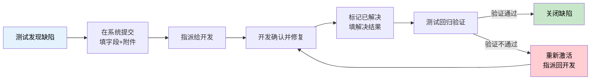
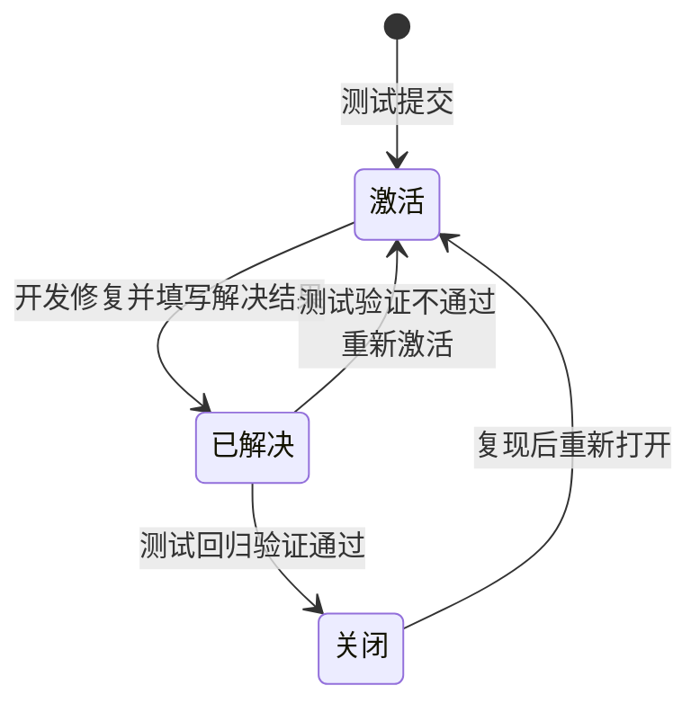

# 禅道与 Jira 实战教程（软件测试人员专用）

> 本教程面向软件测试工程师，系统讲解国内最主流的两个研发管理平台：**禅道（ZenTao）** 和 **Jira**。覆盖缺陷全生命周期流转、测试用例管理、需求与迭代管理、JQL 查询、Git 集成与质量度量，并给出面试现场演示的完整操作路径。

<div class="tutorial-meta">
    <span class="difficulty-badge difficulty-beginner">📘 入门难度</span>
    <span class="meta-item">⏱ 约 2 天</span>
    <span class="meta-item">📋 前置：软件测试基础、缺陷报告写作</span>
    <span class="meta-item">🎯 目标：能独立在禅道/Jira 中完成用例执行与缺陷闭环</span>
</div>

| 项目 | 要求 | 获取方式 |
|------|------|----------|
| 测试基础 | 了解测试流程、缺陷报告要素 | [软件测试理论基础](../基础理论/软件测试理论基础教程.md) |
| 缺陷报告 | 会写标题、复现步骤、实际/期望结果 | [缺陷报告模板](../模板库/缺陷报告模板.md) |
| 用例设计 | 掌握等价类、边界值、场景法 | [测试用例设计方法论](../基础理论/测试用例设计方法论教程-软件测试版.md) |
| 运行环境 | 能使用 Docker 或安装本地软件 | [Docker 容器教程](Docker容器教程-软件测试版.md) |

---

## 新手导读

很多新手把"会写缺陷报告"当成会提缺陷。但在真实工作中，测试人员的缺陷是**提交在系统里**的，而不是写在 Word 文档里。

招聘 JD 里出现频率最高的一条工具要求就是：

> "熟练使用至少一种测试管理平台（**禅道、Jira** 等），能够独立完成用例执行、缺陷提交及缺陷跟踪"

这句话包含三件事，缺一不可：

1. **用例执行**：用例不是写给自己看的，要在系统里建、挂到测试单上、逐条执行并记录结果。
2. **缺陷提交**：字段要填对（严重程度 vs 优先级、影响版本、复现率），附件要齐（截图、日志、录屏）。
3. **缺陷跟踪**：推动状态流转，修复后回归验证，验证不通过要**重新打开**而不是新提一个。

第一遍学习重点掌握**缺陷的完整流转闭环**，这是面试最常被要求现场演示的操作。用例管理和需求管理可以在掌握流转之后再补。

!!! warning "先记住一条"
    **截图和录屏不是可选项。** 一个没有附件、没有复现步骤的缺陷，开发会直接打回给你，这不是"态度问题"，是流程规范问题。本教程后面会讲清每个字段为什么必须填。

### 版本与维护说明

| 项目 | 说明 |
|------|------|
| 适用范围 | 禅道开源版/企业版、Jira Cloud/Data Center、常见国产替代（TAPD、PingCode、Tower） |
| 使用建议 | 两个平台都动手注册体验一遍；重点掌握字段语义与流转逻辑，UI 位置靠猜也能找到 |
| 更新提醒 | 禅道与 Jira 的界面和菜单在不同版本间会调整，本教程以核心概念与操作逻辑为主，具体菜单位置请以你使用的版本为准 |

---

## 一、为什么测试人员必须先学缺陷管理工具

### 1.1 缺陷管理的真实流程



### 1.2 没有工具会发生什么

| 场景 | 后果 |
|------|------|
| 缺陷用 Excel 记录 | 无法追溯谁在改、改到哪一步；开发说"没收到"，测试说"早发了" |
| 缺陷只在群里说 | 被消息淹没，上线前无法统计遗留缺陷数 |
| 状态不流转 | 无法回答"这一版还有多少未关闭缺陷"这个上线决策问题 |
| 不填影响版本 | 无法判断缺陷是新引入还是历史遗留，无法评估回归范围 |

### 1.3 工具是测试的"工作台"，不是负担

!!! abstract "换个视角"
    缺陷管理工具的价值不在于"记录"，而在于**让质量状态可被度量**。当你需要回答"这个版本能不能上线"时，你要能给出：
    - 本轮提交缺陷数 / 已修复数 / 遗留数
    - 按严重程度分布的缺陷构成
    - 重开率（反映修复质量）
    - 逃逸缺陷数（上线后发现的）
    这些数字全都来自工具里的字段，**字段填不对，报表就是垃圾**。

---

## 二、禅道速通

### 2.1 禅道是什么

禅道（ZenTao）是国产开源研发管理工具，由青岛易软天创开发，用 PHP 编写。它是国内中小企业和外包项目**使用最广泛**的测试管理平台，特点是"一条龙"：需求、任务、缺陷、用例、测试单、发布全都内置。

| 版本 | 说明 | 适用 |
|------|------|------|
| 开源版 | 免费，功能完整 | 学习、小团队 |
| 企业版 | 付费，含更多报表和权限 | 中型团队 |
| 旗舰版 | 付费，含 DevOps 集成 | 大型团队 |

学习阶段用**开源版**即可，功能足够覆盖面试要求。

### 2.2 本地安装（推荐 Docker，5 分钟搞定）

用 Docker 最快，官方镜像可直接拉起：

```bash
# 拉取禅道开源版镜像
docker pull easysoft/zentao:latest

# 启动（映射 80 端口，指定时区）
docker run -d --name zentao \
  -p 8080:80 \
  -e TZ=Asia/Shanghai \
  easysoft/zentao:latest

# 查看启动日志，等待初始化完成
docker logs -f zentao
```

启动后浏览器访问 `http://localhost:8080`，按引导完成数据库初始化，默认管理员账号一般是 `admin`，首次登录会要求修改密码。

!!! tip "不想装 Docker 怎么办"
    官网提供 Windows 一键安装包（集成 Apache + PHP + MySQL），解压后双击启动即可。学习用哪种都行，关键是把环境跑起来动手点。

### 2.3 核心对象模型（最容易搞混的地方）

禅道是**双体系**结构，"产品"和"项目"是两条并行的线：

```text
产品线（管"做什么"）                    项目线（管"怎么做完"）
├── 产品 Product                        ├── 项目 Project
│   ├── 需求 Story                      │   ├── 任务 Task
│   ├── 计划 Plan                       │   ├── 版本/Build
│   ├── 模块 Module                     │   ├── 测试单 TestTask
│   ├── 用例 Case                       │   └── 发布 Release
│   └── 缺陷 Bug  ←──────── 缺陷挂在产品上 ────────┘
```

**关键规则（面试常问）：**

| 对象 | 挂在哪 | 说明 |
|------|--------|------|
| 需求 Story | 产品 | 需求的来源，可拆成任务 |
| 任务 Task | 项目 | 开发的工作单元 |
| **用例 Case** | 产品 | 用例属于产品，可复用到多个测试单 |
| **缺陷 Bug** | **产品**（指定影响版本） | **缺陷挂产品，不挂项目**，这是禅道最易错点 |
| 测试单 TestTask | 项目 + 版本 | 一次测试执行的载体，关联用例集 |
| 版本 Build | 项目 | 提测的构建包 |
| 发布 Release | 产品 | 对外发布的版本 |

!!! warning "为什么缺陷挂产品？"
    因为产品是持续存在的，而项目会结束。缺陷如果挂在项目上，项目一关，历史缺陷就找不到了。挂产品才能形成"这个产品累计有多少缺陷"的质量档案。

### 2.4 建立产品与项目

**建产品：**

1. 顶部菜单「产品」→「创建产品」
2. 填写产品名称、代号、负责人
3. 建完后进入「产品」→「模块」，把产品的功能模块树建起来（例如：首页、购物车、订单、支付、用户中心）

**模块树很重要**：提缺陷时要选"所属模块"，它是后续统计"哪个模块缺陷最多"的依据。

**建项目：**

1. 顶部菜单「项目」→「创建项目」
2. 选择项目类型（敏捷/瀑布/看板）
3. 关联所属产品
4. 设置起止时间

### 2.5 从需求到用例

**建需求：**

「产品」→「需求」→「提需求」，填写标题、描述、验收标准、优先级、预计工时。

需求描述里**验收标准**这一项对测试至关重要——它就是你的测试依据。如果需求没写验收标准，要主动在需求评审时提出。

**写用例：**

「测试」→「用例」→「建用例」，关键字段：

| 字段 | 说明 | 填写要点 |
|------|------|----------|
| 所属产品 / 模块 | 用例归属 | 模块要选到最细一级 |
| 用例标题 | 一句话说清"验证什么" | 用"验证 + 条件 + 预期"，如"验证密码错误时提示文案正确" |
| 前置条件 | 执行前必须满足的状态 | 如"已登录""购物车有 1 件商品" |
| 步骤 | 编号的操作步骤 | 一步一个动作，可执行、可复现 |
| 预期结果 | 每步或整体预期 | **禁止写"正常""正确"** |
| 类型 | 功能/性能/接口/安装/安全/其他 | 影响后续按类型统计 |
| 优先级 | 1-4（1 最高） | 与"会不会阻塞主流程"挂钩 |
| 适用阶段 | 单元/集成/系统/验收 | 影响测试单组装 |

用例编写规范详见 [测试用例模板](../模板库/测试用例模板.md)。

### 2.6 提交缺陷（核心操作）

「测试」→「Bug」→「提 Bug」，这是**面试最可能让你现场演示**的操作。

| 字段 | 必填 | 说明与填写要点 |
|------|------|----------------|
| 所属产品 | ✅ | 选定后模块树才会刷新 |
| 所属模块 | ✅ | 选到最细一级，否则统计无意义 |
| 影响版本 | ✅ | 你在哪个版本发现的；用于判断回归范围 |
| 所属项目 | ⬜ | 便于按项目统计本轮提测质量 |
| Bug 标题 | ✅ | **最有技术含量的一栏**，见下方公式 |
| 严重程度 | ✅ | 1-4，描述**缺陷本身的破坏力** |
| 优先级 | ✅ | 1-4，描述**修复的紧急程度**，由业务决定 |
| Bug 类型 | ✅ | 代码错误/界面优化/设计缺陷/性能问题/标准规范/其他 |
| 重现步骤 | ✅ | 编号写，含前置条件和数据 |
| 附件 | ✅ | 截图/录屏/日志，缺一不可 |
| 操作系统 / 浏览器 | ⬜ | 兼容性缺陷必填 |
| 抄送给 | ⬜ | 涉及产品、开发负责人时填 |
| 指派给 | ✅ | 指派给对应模块的开发 |

**Bug 标题公式（强烈建议背下来）：**

```text
[模块] + 操作条件 + 现象

✅ 好标题：
【购物车】商品库存不足时点击结算，页面白屏且未给出提示
【订单】支付回调重复通知，订单状态被重复更新导致金额翻倍
【登录】手机号含前后空格时提示"账号不存在"，应先 trim 再校验

❌ 坏标题：
结算有问题
支付页面报错
登录不对劲
```

**严重程度 vs 优先级（高频考点）：**

| 对比项 | 严重程度 | 优先级 |
|---|---|---|
| 描述的是 | 缺陷对系统的**破坏力** | 缺陷的**修复紧急度** |
| 由谁定 | 测试主导（技术判断） | 产品/项目经理主导（业务判断） |
| 例子 | 崩溃、数据错误 = 高 | 影响大促主流程的文案错误 = 高 |

经典反例：**官网首页 Logo 拼写错误** —— 严重程度低（不影响功能），但优先级高（老板会看见）。反过来，**某个一年用一次的后台导出功能崩溃** —— 严重程度高，优先级可能低。

### 2.7 缺陷流转（必须掌握的闭环）



**解决结果（resolution）常见取值：**

| 解决结果 | 含义 | 测试的应对 |
|----------|------|------------|
| 已修复 | 已改代码 | 回归验证 → 通过则关闭 |
| 重复 | 与已有缺陷重复 | 核对后关闭，把复现信息补充到主缺陷 |
| 设计如此 | 按设计实现，非缺陷 | **回到需求确认**，若需求确实如此则关闭；若无明确需求则升级为需求问题 |
| 不予解决 | 不修 | 问清原因，评估风险，记录遗留并写入测试报告 |
| 延期 | 本版本不修 | 记录到遗留缺陷清单，跟进下版本 |
| 外部原因 | 第三方/环境问题 | 确认证据，可能需要转给运维或供应商 |

!!! warning "测试最容易犯的错"
    验证不通过时，**不要新建一个缺陷**，要在原缺陷上点「激活」并说明"验证不通过，原因是 XXX"。新建会导致缺陷数量虚高、追溯断裂，面试官一听就知道你没实战过。

### 2.8 测试单与版本管理

测试单（TestTask）是"一次测试执行"的载体：

1. 「测试」→「测试单」→「创建测试单」
2. 选择所属项目、**关联版本（Build）**、负责人
3. 关联用例：按模块或标签批量拉取用例
4. 执行用例：逐条标记通过/失败/阻塞
5. 用例失败 → 直接从上一步的"转 Bug"按钮提单，**自动带出用例步骤**，省去重写复现步骤

这一套流程走完，你就有了完整的测试执行记录，导出即为测试报告的数据来源。

### 2.9 统计与报表

禅道内置报表在「测试」→「Bug」页面的统计区，以及「地盘」→「统计」：

| 报表 | 用途 |
|------|------|
| Bug 按严重程度分布 | 判断本轮质量（严重缺陷多说明质量差） |
| Bug 按模块分布 | 定位质量薄弱模块 |
| Bug 按状态分布 | 计算遗留缺陷数，支撑上线决策 |
| Bug 趋势（新增 vs 解决） | 判断是否收敛，是发布准入的关键指标 |
| 用例执行情况 | 通过率、失败率 |

!!! tip "上线准入的判断方法"
    健康的收敛曲线是"新增缺陷数持续下降，解决缺陷数持续上升"。如果上线前一天新增缺陷仍在高位，说明系统还不稳定，**这就是你给出"建议延期上线"的数据依据**。

---

## 三、Jira 速通

### 3.1 Jira 是什么

Jira 是 Atlassian 公司的项目管理工具，是国际主流标准，外企、互联网大厂、出海团队使用广泛。相比禅道，Jira 更灵活但**需要自己配置工作流**。

### 3.2 核心概念模型

```text
Project（项目）
├── Issue（问题/工单）← 一切对象的统称
│   ├── Issue Type：Story / Bug / Task / Sub-task / Epic
│   ├── Status：To Do / In Progress / In Review / Done
│   ├── Workflow：定义 Status 之间怎么流转
│   ├── Assignee：经办人
│   ├── Reporter：报告人（通常是测试）
│   ├── Priority：Highest / High / Medium / Low / Lowest
│   ├── Component：模块
│   ├── Label：标签（如 smoke、regression）
│   ├── Affects Version：影响版本
│   └── Fix Version：修复版本
├── Board（看板）：Scrum 板 / Kanban 板
└── Sprint（迭代）：Scrum 板的迭代周期
```

**与禅道最大的差异：**

| 对比项 | 禅道 | Jira |
|---|---|---|
| 对象命名 | 需求/任务/用例/Bug 各自独立 | 统一叫 Issue，靠 Issue Type 区分 |
| 测试用例 | 内置用例模块 | **原生不支持用例管理**，需插件（Zephyr/Xray）或外部工具 |
| 工作流 | 内置固定流程 | 完全可自定义 |
| 上手成本 | 低 | 高（配置量大） |
| 适用 | 国内中小企业、外包 | 外企、大厂、敏捷团队 |

### 3.3 创建缺陷

在 Jira 里通常点顶部「Create」按钮，或从看板某列直接建卡片：

| 字段 | 说明 |
|------|------|
| Project | 目标项目 |
| Issue Type | 选 **Bug** |
| Summary | 即标题，同样用"[模块] 条件 + 现象"公式 |
| Description | 建议用固定模板（见下） |
| Priority | 优先级 |
| Component | 模块 |
| Affects Version | 影响版本 |
| Fix Version | 修复版本（通常由开发填） |
| Assignee | 经办开发 |
| Reporter | 默认是你（报告人） |
| Labels | 打标签如 `smoke`、`regression`、`blocker` |
| Sprint | 归入哪个迭代 |
| Attachment | 截图/录屏/日志 |
| Linked Issues | 关联（blocks / is blocked by / duplicates / relates to） |

**推荐的 Description 模板（可直接粘到 Jira）：**

```markdown
h3. 环境
测试环境 / 版本号 / 浏览器或机型

h3. 前置条件
账号状态、数据准备情况

h3. 复现步骤
1. 打开 xxx 页面
2. 输入 xxx
3. 点击 xxx

h3. 实际结果
（描述现象 + 截图）

h3. 期望结果
（应表现为什么，依据是哪份需求/接口文档）

h3. 复现率
必现 / 5 次中 2 次

h3. 附件
截图.png / 录屏.mp4 / 服务端日志.txt
```

!!! tip "Linked Issues 的实战价值"
    一个"重复扣款"缺陷，往往同时关联"支付回调幂等性"和"订单状态机"两个技术债。用 `blocks` 标出阻塞关系，能让项目经理一眼看出**这个缺陷卡住了哪些下游工作**——这是你体现测试视角的机会。

### 3.4 工作流与状态流转

Jira 的状态名由团队配置，常见组合：

```text
To Do → In Progress → In Review → Done
  ↑                                  |
  └──────── Reopened ←───────────────┘
```

测试重点关注两个动作：

| 动作 | 含义 | 注意 |
|------|------|------|
| **Reopen** | 验证不通过，打回 | 必须写明"验证不通过 + 原因"，不能只写"还是不行" |
| **Close / Done** | 验证通过 | 确认修复版本正确，别把没验的关掉 |

### 3.5 JQL：Jira 的核心竞争力

JQL（Jira Query Language）是 Jira 的查询语言，**面试高频考点**——能说出几个实用 JQL，立刻区别于只会点鼠标的候选人。

```jql
-- 我名下所有未完成的缺陷
project = "EC" AND assignee = currentUser() AND status != Done

-- 本周新增的高优先级缺陷
project = "EC" AND type = Bug AND priority in (High, Highest)
  AND created >= -7d ORDER BY created DESC

-- 当前迭代内我负责的、待验证的缺陷
sprint in openSprints() AND assignee = currentUser() AND status = "In Review"

-- 文本搜索（找某个功能的缺陷）
project = "EC" AND text ~ "支付回调"

-- 按标签找冒烟测试相关
labels in (smoke) AND status != Done

-- 最近 3 天状态变成 Done 的
status changed to Done after -3d

-- 曾指派给我但现在不是我的（交接追踪）
assignee was currentUser() AND assignee != currentUser()

-- 影响版本是本迭代且未修复的
affectedVersion = "v2.3.0" AND resolution = Unresolved
```

**常用函数与操作符速查：**

| 元素 | 说明 |
|------|------|
| `currentUser()` | 当前登录用户 |
| `openSprints()` | 当前打开的迭代 |
| `startOfDay()` / `-7d` / `-4w` | 时间函数与相对时间 |
| `in` / `not in` | 集合匹配 |
| `~` | 模糊文本匹配 |
| `was` / `changed` | 追踪历史值变化 |
| `ORDER BY ... DESC` | 排序 |
| `AND` / `OR` / `NOT` | 逻辑组合，注意括号优先级 |

!!! tip "JQL 的实战用法"
    把常用的 JQL 存成 **Filter**，再把 Filter 挂到 Dashboard 的 Gadget 上，就得到一块自动更新的质量看板。例如"遗留缺陷趋势""按模块分布""重开率"，每天站会直接投屏用。

### 3.6 与 Git 集成（智能提交）

Jira 支持在 Git 提交信息里写 Issue Key，实现代码与缺陷的双向关联：

```bash
git commit -m "EC-123 修复支付回调重复通知导致订单金额翻倍

- 增加回调幂等校验（按 trade_no 去重）
- 补充单元测试
#time 3h #comment 已修复并自测通过"
```

支持的提交指令：

| 指令 | 效果 |
|------|------|
| `PROJ-123` | 关联到该 Issue |
| `#comment 内容` | 在 Issue 下添加评论 |
| `#time 2h` | 记录工时 |
| `#close` / `#resolve` | 触发状态流转 |

这样在 Jira 的缺陷详情页就能看到"关联的代码提交"，回归时能直接确认**到底改了哪些文件**——这是判断回归范围的直接依据。

---

## 四、禅道 vs Jira 选型对比

| 维度 | 禅道 | Jira |
|------|------|------|
| 成本 | 开源版免费 | 按用户数付费，较贵 |
| 中文支持 | 原生中文 | 需配置语言包 |
| 用例管理 | 内置，开箱即用 | 需插件（Zephyr / Xray） |
| 工作流 | 内置固定 | 完全自定义（灵活也是负担） |
| 上手速度 | 快 | 慢 |
| 报表能力 | 够用 | 强（配合 Dashboard 与插件） |
| 生态集成 | 少 | 多（Confluence、Bitbucket、CI 全打通） |
| 常见于 | 国内中小企业、外包、传统行业 | 外企、大厂、出海、敏捷团队 |

!!! abstract "面试怎么说"
    被问到"你用过什么缺陷管理工具"时，**不要只答名字**。可以这样组织：

    "我主要用禅道做缺陷和用例管理，也用 Jira 跟踪过迭代任务。禅道的用例管理是内置的，提缺陷时能直接从用例转 Bug、自动带出步骤；Jira 的强项是 JQL 和自定义工作流，我会把常用的遗留缺陷、重开率查询存成 Filter 挂到 Dashboard 上，每天站会看收敛趋势。"

    这段话同时证明了：用过、懂差异、会用报表支撑决策。

---

## 五、缺陷报告的质量标准

工具里的字段设计，本质上是在**强制你写清楚一个缺陷**。下面这份对照表可以直接当自查清单用：

| 要素 | 不达标 | 达标 |
|------|--------|------|
| 标题 | "支付有问题" | "【订单】支付回调重复通知时，订单金额被重复累加" |
| 环境 | 没写 | "测试环境 v2.3.0 / Chrome 120 / Android 14" |
| 前置条件 | 没写 | "购物车有 1 件库存为 1 的商品，已登录" |
| 复现步骤 | "点了结算就白屏" | 编号 3 步，含输入数据 |
| 实际结果 | "报错了" | "页面白屏，控制台报 `Cannot read property 'total' of null`" |
| 期望结果 | "应该正常" | "应展示结算页，按需求 3.2 应显示实付金额" |
| 复现率 | 没写 | "5 次中 3 次，与网络延迟有关" |
| 附件 | 没有 | 截图 + 录屏 + 服务端日志 |

### 5.1 缺陷描述的三个常见错误

!!! warning "错误一：把推断当结论"
    ❌ "这个缺陷是因为 Redis 缓存没失效导致的。"
    你只是测试，**不要替开发下结论**。应该写证据：

    ✅ "手动 `DEL` 商品详情缓存后立即恢复正常；`TTL` 返回 -1（永不过期）。"

    给出证据，让开发自己得出结论——这既是严谨，也是自我保护。

!!! warning "错误二：现象和原因混在一起"
    标题要写**现象**，不要把猜测的原因塞进标题。标题里出现"因为…所以…"通常意味着你把两个字段的内容挤在一起了。

!!! warning "错误三：只描述一次偶现，不记录上下文"
    偶现缺陷最需要记录的是**当时的环境变量**：并发数、数据量、网络状态、时间点。没有这些，开发无法复现，缺陷就会在"无法重现"里躺到上线。

---

## 六、缺陷度量与质量报告

### 6.1 核心度量指标

| 指标 | 计算方式 | 用它判断什么 |
|------|----------|--------------|
| 缺陷密度 | 缺陷数 / 功能点（或千行代码） | 模块质量横向对比 |
| 缺陷收敛趋势 | 每日新增 vs 已解决 | 版本能否按期上线 |
| 严重缺陷占比 | 严重缺陷数 / 总缺陷数 | 质量基线是否合格 |
| **缺陷重开率** | 重开数 / 已解决数 | **开发修复质量**，高说明没改到位 |
| 遗留缺陷数 | 未关闭缺陷数 | 上线风险 |
| 逃逸缺陷数 | 上线后发现的缺陷数 | **测试有效性**，最有价值的反向指标 |

### 6.2 从工具数据到上线建议

!!! abstract "一个完整的上线判断逻辑"
    **数据**：遗留缺陷 12 个，其中严重 1 个（某后台导出功能崩溃）、一般 5 个、轻微 6 个；近 3 天新增缺陷从 8 个降到 2 个；重开率 18%。

    **分析**：
    - 收敛趋势良好 → 质量在稳定
    - 严重缺陷 1 个，但属于低频使用模块，可评估带缺陷上线 + 下版本修复
    - 重开率 18% 偏高 → 提示开发修复质量一般，**核心流程要加大回归力度**

    **建议**：核心链路（登录、下单、支付）可上线；导出功能缺陷列为已知问题，写入发布说明并由产品确认；下版本优先修复。

    这就是一份**有数据支撑、有明确结论和风险提示**的测试结论，而不是"测试完成，可以上线"这种空话。

---

## 七、面试高频题与现场演示

### 7.1 高频问题

| 问题 | 回答要点 |
|------|----------|
| 提一个缺陷需要哪些要素？ | 标题、环境、前置条件、复现步骤、实际结果、期望结果、复现率、附件、严重程度、优先级 |
| 严重程度和优先级的区别？ | 破坏力 vs 紧急度；由谁定；举 Logo 反例 |
| 验证不通过怎么办？ | 在原缺陷上**重新激活**并说明原因，不新建 |
| 开发说"不是缺陷"怎么办？ | 回到需求/设计文档找依据；若无明确约定，升级为需求问题讨论，而非争论 |
| 缺陷一直不修怎么办？ | 评估风险等级 → 在站会/评审上同步影响 → 记录为遗留缺陷并写入报告，让决策留痕 |
| 怎么判断能不能上线？ | 用收敛趋势 + 严重缺陷占比 + 核心链路覆盖情况综合判断 |
| 重开率说明什么？ | 开发修复质量；高则需要加强回归和用例评审 |
| 逃逸缺陷怎么分析？ | 归因：用例未覆盖 / 环境差异 / 偶现未重视 / 需求理解偏差 → 反哺用例库 |

### 7.2 现场演示的完整路径

如果面试官让你"演示一下怎么提一个缺陷"，按这个顺序操作，边做边说：

```text
1. 进入项目 → 说明这是什么产品、我负责哪个模块
2. 打开用例 → 找到对应用例，说明这是从需求拆出来的
3. 执行用例 → 标记失败，点"转 Bug"
4. 填标题   → 念出标题公式，说明为什么这么写
5. 选模块   → 说明模块树对后续统计的意义
6. 填严重程度优先 → 解释两者差异（故意展示这个知识点）
7. 写复现步骤 → 逐条念，强调"含数据和前置条件"
8. 加附件   → 截图 + 日志，说明为什么附件是必须的
9. 指派     → 说明指派给对应模块开发的逻辑
10. 演示流转 → 开发修复 → 已解决 → 我验证 → 通过则关闭 / 不通过则重新激活
11. 展示报表 → 打开缺陷分布图，说明怎么看收敛趋势
```

!!! tip "加分动作"
    演示时主动说一句："**这个缺陷我会在标题里带上模块前缀，因为我们的统计报表是按模块聚合的，方便定位质量薄弱模块。**"
    这一句就把"会用工具"提升到了"理解工具为什么这么设计"，是候选人之间的分水岭。

---

## 八、动手任务：走通一次完整的缺陷闭环

### 任务背景

你现在是一个电商 App 的测试人员，负责「购物车」模块。在测试中发现了一个缺陷：

> 商品参与"满 100 减 20"活动，购物车中该商品数量从 1 件加到 2 件（金额 120 元）时，优惠金额仍按单件计算，实际只减 20 元，按规则应减 20 元但金额计算逻辑应为"满 200 减 40"——即**阶梯满减未随数量重算**。

### 任务准备

1. 本地启动禅道（Docker 或安装包均可）
2. 创建一个产品「电商 App」，建立模块树：首页 / 购物车 / 订单 / 支付 / 用户中心
3. 建立一个项目并关联该产品

### 任务要求

1. **建 1 条需求**：满减活动规则，写明验收标准
2. **建 3 条用例**：分别覆盖满减的**正常场景、边界场景（刚好 100 元）、异常场景（叠加优惠券）**
3. **提 1 个缺陷**：按上面的场景提交，必须包含：
   - 符合标题公式的标题
   - 正确的严重程度与优先级，并说明你的判断理由
   - 编号的复现步骤（含数量、金额等具体数据）
   - 实际结果与期望结果
   - 一张截图（可用任意图片占位）作为附件
4. **走完流转**：模拟开发修复 → 标记已解决 → 你验证通过 → 关闭；再模拟一次**验证不通过 → 重新激活**
5. **导出或截图 2 张报表**：缺陷按严重程度分布、缺陷按状态分布

### 提交物

| 产出 | 说明 |
|------|------|
| 用例截图 | 3 条用例，含前置条件与预期结果 |
| 缺陷详情截图 | 完整字段可见 |
| 流转记录截图 | 含"重新激活"那一次 |
| 报表截图 | 2 张 |
| 一段文字说明 | 150 字内，说清你的严重程度/优先级判断理由和上线建议 |

### 完成标准

- [ ] 缺陷标题符合"[模块] 条件 + 现象"公式，一眼能看懂
- [ ] 严重程度与优先级的理由能自圆其说
- [ ] 复现步骤含具体数据，他人照着做能复现
- [ ] 预期结果引用了需求依据，不是"应该正常"
- [ ] 附件齐全
- [ ] 完整走通「激活 → 已解决 → 关闭」和「已解决 → 激活」两条路径
- [ ] 能根据报表数据给出明确的上线建议

### 阶段测验

完成教程后，建议做 [禅道与Jira测验](禅道与Jira测验.md) 检验学习效果。

### 通关检查

完成本教程后，使用 [第2阶段-工具实战通关](../学习中心/第2阶段-工具实战通关.md) 检查是否可以进入下一阶段。

---

## 附录：速查表

### 缺陷必填要素

```text
标题    [模块] + 条件 + 现象
环境    测试环境 / 版本 / 浏览器或机型
前置    账号、数据、状态
步骤    编号，含输入数据
实际    现象 + 报错 + 截图/日志
期望    应为什么 + 需求依据
复现率  必现 / N 次中 M 次
附件    截图 + 录屏 + 日志
程度    1-4（破坏力）
优先级  1-4（紧急度，业务定）
```

### 禅道核心路径

```text
产品 → 模块 → 需求 → 用例
项目 → 版本 → 测试单 → 执行用例 → 转 Bug
Bug → 激活 → 已解决 → 关闭 / 重新激活
报表 → 严重程度分布 / 状态分布 / 收敛趋势
```

### Jira 常用 JQL

```jql
project = "EC" AND assignee = currentUser() AND status != Done
type = Bug AND priority in (High, Highest) AND created >= -7d
sprint in openSprints() AND status = "In Review"
text ~ "支付回调"
status changed to Done after -3d
affectedVersion = "v2.3.0" AND resolution = Unresolved
```

### 质量度量

```text
缺陷密度     缺陷数 / 功能点
收敛趋势     每日新增 vs 已解决
严重占比     严重缺陷 / 总缺陷
重开率       重开数 / 已解决数   → 修复质量
逃逸缺陷     上线后发现数       → 测试有效性
```
